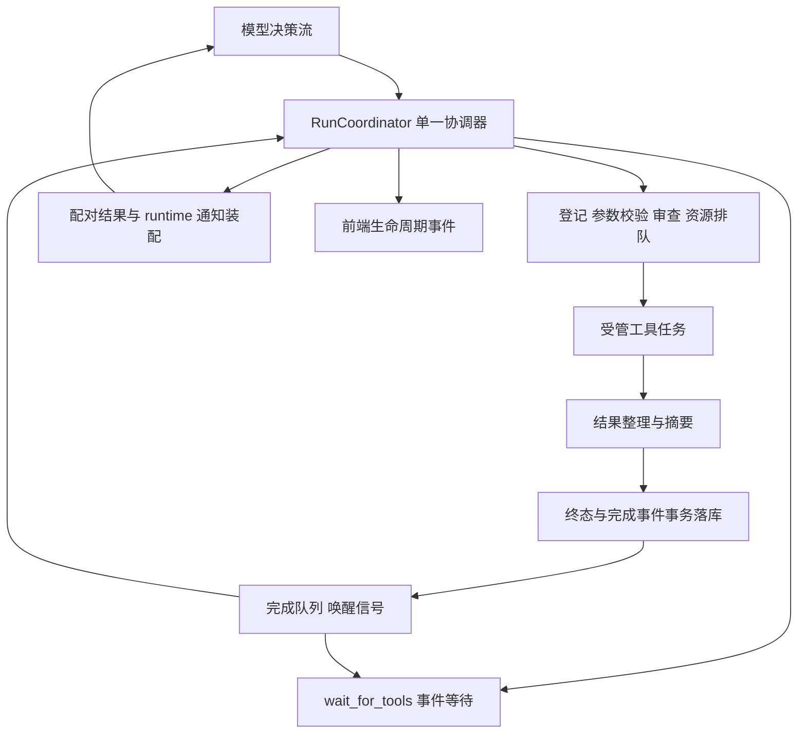

> 实施状态（2026-09-26）：本文下方的源码行号与旧实现描述属于设计考察基线，不代表当前代码。主、子循环已接入共享调度、200ms 回执、事件等待和 runtime 完成交付；尚不能把整个验收清单视为全部完成。
>
> 当前已完成：v8/outbox 与重启事实恢复；调用身份与运行租约；共享资源/执行/摘要预算；主子失败与等待控制；ToolProgram 叶子调度及 ACP 工作区租约；前端任务归并和重载对账；canvas 取消确认；本机命令/SSH 结构化失败；MCP 取消通知与 transport 收尾。
>
> 本轮补充：排队执行额度支持取消及 deadline；统一超时向调用传递取消并等待底层收敛；协议与业务工具混批拒绝；子循环重复调用 ID 校验；ToolProgram 叶子 origin/step 追踪；整批台账及身份原子登记，窗口失败先配对应答再收尾。
>
> 仍需完成并验收：自管审查在资源获取前完成；异常退出配对的更多竞态覆盖；规范化副作用在途去重；ContextEntry/LoopProfile 全面收敛；模型阶段与工具阶段独立展示；更多取消、图片、重载和失败竞态端到端测试。以实际测试结果逐项验收，不以模块存在代替行为证明。

# 主 Agent 异步工具循环设计

状态：基础实现进行中，尚未完成异步运行时接入。考察基线：2026-09-26，提交 `1bb3d77`；当前工作区 schema 已升级 v8。

> 本文保留最初设计记录。最终范围以用户确认的「主、子 Agent 统一异步工具循环实现方案」为准：子 Agent 内部也必须迁移；wait_for_tools 为宿主保留控制能力，不进入业务 allowedTools。

## 实施进度（2026-09-26）

- 已实现：主循环拆分为决策入口、profile、批次执行；不可变调用上下文替代 ToolCallSlot；策略依赖 owned clone；登记失败阻止执行；执行参数使用规范化结果；同代运行句柄可克隆。
- 已实现并单测：资源集合原子仲裁、冲突 FIFO、独立资源越过等待队列、取消回收、task-local 隔离。
- 已实现并单测：v7→v8 快照迁移、工具身份字段、completion outbox、终态/原文产物/完成事件事务结算、重复结算幂等、scope 查询隔离。新增 Rust DTO/SQL 投影与 TypeScript 字段同步。
- 尚未接入：TaskScheduler/Coordinator、200ms 批次回执、runtime 消息交付与观察确认、显式/隐式等待、共享主子内核、子失败策略、统一 shutdown、所有工具取消适配、前端任务归并和恢复快照。资源仲裁与 outbox 目前只有基础 API 和测试，生产循环仍串行。
- 验证：后端 agent 范围 504 项测试通过；前端相关 Vitest 159 项通过；cargo check、TypeScript、build、lint、contract:check 通过。尚未接入的基础模块有 dead_code 告警；跨轮执行等最终验收未完成。


## 1. 设计结论与需求边界

将主循环改为**一个模型决策流、一个运行时协调器、多个受管工具任务**。模型请求仍按顺序产生，工具任务可以跨模型轮次执行；每次请求之前，运行时确定性地装配已完成结果。模型可以继续调用独立工具，也可以调用 `wait_for_tools` 主动让出决策权，直到运行时收到完成事件再唤醒。

这里的“异步”必须区分三个维度：

| 维度 | 本方案的语义 |
| --- | --- |
| 执行异步 | 工具 future 由受管 worker 驱动，主循环不必等工具完成 |
| 决策继续 | 返回受理回执后，下一次模型请求可以立即开始 |
| 工具并发 | 只有资源与访问策略兼容的任务可以同时执行，冲突任务排队 |

目标不是让同一会话同时有多个模型修改历史。会话消息、请求快照、协议动作与收口仍由一个协调器维护。普通完成事件在下一次模型请求边界交付；模型正在流式生成时，不强行把新消息塞进已经发出的请求。严重故障和用户取消可以中断流。

首版范围：run 内后台任务、自动完成通知、事件等待、资源互斥、可靠落库与取消收敛。不实现后台任务跨应用重启续跑，不默认让工具脱离所属 run，也不增加模型轮询任务状态的工具。

## 2. 已验证的现有实现

以下行号对应考察基线，仅用于定位，实施后应按符号重新查找。

| 代码位置 | 当前行为 | 对设计的影响 |
| --- | --- | --- |
| `src-tauri/src/agent/rig_ext/loop.rs:244`，`run_loop_inner` | `for iteration` 中依次压缩历史、请求模型、消费流、执行整批工具 | 主循环与工具完成存在批次屏障 |
| `loop.rs:373` | 没有 tool calls 且有正文就落库并发送 `Finished` | 有在途任务时必须改为进度消息或隐式等待 |
| `loop.rs:447`、`:558` | `execute_tool_calls(...).await`，内部逐个 `before_call → execute → persist → after_call` | 主 Agent 连批内执行也串行；不能仅改成 `join_all` |
| `loop.rs:473`、`loop/protocol.rs` | 协议动作优先于可重试错误和最终消息 | `submit_graph`、`message` 的收口需要跨批次任务屏障 |
| `common/message.rs:145`，`repair_tool_call_pairing` | 只匹配 assistant 后连续的 tool 消息；补缺失结果、丢弃孤儿结果 | 延迟追加原 call_id 的第二条 tool 消息不可行 |
| `loop/app_policy.rs:102`、`tools/deps.rs:47` | `ToolCallSlot` 是共享可变 `Arc<Mutex<Option<String>>>`，调用前写、收尾清 | 并发会发生父调用 ID 串号，尤其影响子 Agent 和同步进度 |
| `loop/app_policy.rs:188` | 超时包裹工具 future；部分工具自管超时 | 停止等待不等于外部副作用停止 |
| `rig_ext/tool_result.rs:334` | 执行结果准备、摘要、落库、`ToolFinished` 和可变 `UsageTracker` 耦合 | 需分离回执与最终结果，避免共享可变用量与摘要阻塞协调器 |
| `tools/spec.rs:361` | 浏览器共享会话，明确禁止并行；命令按最坏副作用声明 | 异步能力和并发能力必须分别建模 |
| `rig_ext/sub_agent/runner.rs:401`、`:545` | 子 Agent 支持连续只读批 `join_all`，但整批完成后才继续模型 | 可复用策略与预算，不能直接作为跨轮后台调度器 |
| `tools/program/executor.rs:295` | 取消/超时后有界 drain 在途调用 | 保留收敛纪律；复合工具不能造成双层 permit 死锁 |
| `state/run.rs:18` | `ActiveRunStore` 禁止同会话重入，RAII + epoch 清理 | 新任务的生命周期必须纳入同一 run，不能提前释放守卫 |
| `db/tool_runs/lifecycle.rs:110` | 工具台账终态幂等，first finish wins | 可以沿用，但需把最终结果、终态与完成事件合并事务 |
| `dispatcher-chat/event-channel.ts:176`，`live-tool-activity.ts:59` | `ToolFinished` 直接把卡片置终态 | 受理回执不能复用 `ToolFinished` |
| `rig_ext/message.rs:301`、`:368` | 最后一条含普通文本的 rig User 消息是工具图片锚点 | runtime 通知映射为 User 后，必须显式区分真实用户锚点 |
| `tools/exec/ssh.rs:70`、`ssh_tool/mod.rs:207` | SSH 工具与 execute 接口没有 run 取消参数 | 开启后台前需贯通取消；关闭 SSH channel 不保证远端进程已终止 |

现有 `MAX_TOOL_CALLS_PER_BATCH=32`、`MAX_PARALLEL_TOOL_CALLS=4` 可以保留。前者限制模型输出批次大小，后者用于执行并发；需要另加在途任务上限，不能把批次上限误当跨轮容量上限。

## 3. 架构与所有权



建议模块职责：

| 模块 | 职责与状态所有权 |
| --- | --- |
| `loop.rs` | 薄入口、Agent 装配接口；移走现有工具执行和请求状态机 |
| `loop/coordinator.rs` | 唯一持有 messages、上下文标记、请求序号、用量聚合、等待状态、协议收口 |
| `loop/request.rs` | 历史整形、运行快照、模型请求和流消费；只允许一个在途请求 |
| `loop/task_scheduler.rs` | 登记任务、驱动 worker、完成队列、JoinSet 监督、容量与资源调度 |
| `loop/invocation.rs` | 不可变调用上下文与 rig 回调适配 |
| `loop/completions.rs` | 回执/最终结果分流、完成事件去重、runtime 消息交付 |
| `loop/control.rs` | `wait_for_tools`、最终答复、协议屏障、统一 shutdown |
| `db/tool_completions.rs` | 完成事件 outbox、原子结算、交付记录与重启恢复 |

按变化原因拆分现有超长文件，生产模块控制在 500 行内。不要另造工具注册表、另一套工具 trait 或应用级常驻消息总线。

worker 必须持有可独立存活的 DB clone、事件 sink、工具句柄、调用上下文与摘要服务。当前 `AppToolExecutionPolicy<'a>`、`&RigToolSurface`、借用摘要模型和 `&mut UsageTracker` 不能原样放进要求 `'static` 的 `tokio::spawn`。生产策略改为持有轻量 owned handle，工具执行句柄使用 `Arc`；用量由 worker 返回结构化增量，由协调器聚合。

## 4. 调用级上下文：并发化的前置改造

用不可变 `ToolInvocationContext` 替换共享 `ToolCallSlot`：

```rust
struct ToolInvocationContext {
    workspace_id: String,
    agent_run_id: String,
    task_id: String,              // 复用根 dispatcher_tool_runs.id
    tool_call_id: String,         // provider wire_call_id
    request_message_id: String,   // 原 assistant 工具调用消息
    cancel_rx: watch::Receiver<bool>,
    trace: ToolRunTraceContext,
}
```

业务内部函数显式传递上下文。rig 的 `PortableDynamicTool` 回调只接收 JSON 参数，因此只在这个适配边界使用 task-local scope：执行前 scope(context)，回调入口立即取出并 clone，再向业务函数传递。工具自己 spawn 的任务不假设继承 task-local，必须显式传入 clone。嵌套调用建立子上下文，绝不覆盖父上下文。

不要把 task_id、call_id、取消控制信息混进模型可写的工具参数。`before_call` 不再修改共享槽位，`after_call` 不再清槽。

## 5. 工具执行：短任务直返，长任务自动让出

在现有 `TOOL_POLICY_TABLE` 上添加调度元数据，保持唯一事实来源：

- `dispatch = Inline | AutoYield | Control`：是否允许跨轮执行。
- `resource_claims(tool, effective_args, context)`：确定性生成资源及共享/独占访问。
- `cancellation = Cooperative | Contained | Unverified`：实际终止/隔离能力，不能只沿用当前布尔 `cancellable`。

`AutoYield` 和资源并发是独立维度：浏览器可以后台等待，但同一个浏览器会话的动作仍串行。

每批处理步骤：

1. 校验批次大小、控制工具组合、工具可见性。先检测无效控制组合，再执行任何副作用。
2. 持久化 assistant 工具调用消息，登记本批所有任务并绑定 request_message_id。任一步失败，不启动任务；已持久化调用补明确拒绝结果。
3. 对合法普通任务，按声明顺序入调度队列；参数准备、审查、资源取得与执行均为受管阶段。回执只表示受理，不代表通过审查或已开始执行。
4. 本批 `AutoYield` 使用一个共享的短直返窗口，建议初值 200ms。从任务开始受理计时，窗口覆盖排队/审查/执行/结果准备。不是每个工具各等 200ms，也不是执行超时。
5. 窗口内已提交终态的任务，按原调用顺序写真正的 tool result。
6. 其余任务写 accepted 回执，完成这一批的全部协议配对，然后允许下一次模型请求。
7. 任务晚到的最终结果通过 runtime 通知交付，不再给原 call_id 写第二条 tool result。

初值 200ms、执行并发 4、在途根任务上限 32 均为实施建议，需测量后调整；首版作为运行时配置/常量，不增加设置中心 UI。队列已满时为该调用返回明确可恢复的 capacity 错误，不无限排队，也不偷偷执行。排队有独立等待上限，工具执行超时从实际执行开始计算，run 还须有总体 wall-clock 边界。

`Inline` 是未适配工具的保守迁移路径。调用它之前排空与其冲突的后台任务，保留现有同步语义；不要把未知工具自动视为支持后台。正常业务工具逐步适配成 `AutoYield`，控制工具永不进入业务执行队列。

同一轮多个工具不建立基于结果的隐式依赖。需要 A 的真实结果才能执行 B 时，模型必须先收到 A 的最终结果；需要批内数据依赖时沿用 ToolProgram/DAG 的明确依赖关系。

同一 run 内，对规范化后的工具名与 effective_args 相同、仍在途的副作用调用，明确拒绝重复执行并返回已有 task_id；不以自动复用成功结果掩盖重复调用。只约束在途重复，不做通用跨 run 幂等缓存。连续请求全部因容量/相同 pending 任务而无进展时，运行时可在固定有限次数后转 Waiting，避免模型耗尽预算轮询。

## 6. 结果协议：一条调用只应答一次

主循环不能带着悬空 tool_calls 发下一次请求，也不能事后把 accepted 改成成功。采用两阶段语义：原工具调用得到“受理结果”，任务完成产生“运行时观察”。

请求历史示例：

```text
assistant tool_calls: [local_zsh(call_A), list_sub_agents(call_B)]
tool(call_A): {"status":"accepted","task_id":"task_A","state":"running"}
tool(call_B): <实际结果>
assistant tool_calls: [另一个独立工具(call_C)]
tool(call_C): <实际结果或受理回执>
runtime observation → wire user:
  {"kind":"tool_completion","task_id":"task_A","tool_call_id":"call_A",
   "status":"succeeded","context_payload":"..."}
assistant: 根据 A 的真实结果选择下一步
```

在 DB 内使用独立 `role=runtime`（新增显式类型契约），在 LLM 适配层映射为普通 User observation 文本，兼容目前 rig/provider 的消息体系。它来自宿主而非人类，不提高工具输出的指令权限；内容仍按普通工具数据对待。不要伪造第二个 assistant tool_call，不使用 role=tool 存迟到结果，不放进 system 高权限消息。

需要同时调整 `ChatMessage` 来源类型、历史过滤、`chat_message_to_rig`、前端消息投影。运行时通知不是新用户指令，不触发用户轮次切分、标题提取、latest user 查询，也不能覆盖本轮图像锚点。建议协调器将平行 `messages/message_ids` 收敛为内部 `ContextEntry { message, source_id, origin }`，映射请求时再拆出 rig 消息；压缩 splice 同步处理一个结构，避免新增第三个容易错位的平行数组。

对于 inline 任务：现有 tool result 保持语义，只有一次最终结果。对于 background 任务：回执单独标记 `tool_result_mode=accepted`，最终 runtime 消息绑定 task_id/原 tool_call_id；UI 将其更新到原工具卡片。

原始输出、context_payload、display_content、压缩意图和产物引用沿用现有策略。accepted 不生成原始输出产物，也不调用摘要模型。结果整理/摘要在 worker 侧执行，执行资源锁在实际业务操作结束后释放，不能在等摘要模型时继续占锁。

## 7. 确定性完成监听与主循环状态机

采用两个正交状态，避免模型与工具同时运行时无法表达：

- 决策状态：`Ready / Requesting / Dispatching / Waiting / Draining / Closed`。
- 每个任务：`Queued / Reviewing / Running / PreparingResult / Terminal`；Terminal 携带现有成功/可恢复错误/致命错误/取消，以及新增超时/中断等结构化 error_kind。

持久化生命周期可保留 `planned/running/现有终态`，另用明确的 `phase` 字段记录细分阶段，避免把 UI 阶段直接塞进现有 status 后遗漏状态机守卫。queued 不发 ToolStarted；审查可发阶段更新；实际回调开始才记录执行起点。

协调器持有稳定的完成接收器、受管 JoinSet 和当前模型 future。worker 在终态事务成功后发送完成 ID。ID 只用于唤醒，正文从 durable completion 中读取；JoinSet 负责监督 panic、意外返回和取消，不是只在结束时 `join_all`。

**模型运行期间也要泵事件。** `model.stream(request).await` 和 `consume_stream(...).await` 不能变成事件监听的盲区。协调器 pin 当前请求/消费 future，使用 select 同时推进模型、完成队列、JoinSet 监督和取消；每收到完成事件只更新任务表/待交付集合和前端，继续 poll 同一个模型 future，不重新创建请求，不并发修改当前请求历史。

**三个强制检查边界：**

1. 每次请求前：装配 durable 已完成但尚未被模型观察的结果，加入准确的 pending 快照。
2. 每次模型响应后、执行新调用前：吸收流期间新完成的结果，先处理 fatal/cancel，再决定是否接纳新动作。
3. 每次收口前：在停止接纳新任务的协调器状态下，核对在途任务与尚未观察的完成事件。

处理批次时也继续接收旧任务完成事件。后台完成不能等待本轮一个慢 Inline 工具结束才写入系统；由 worker 先 durable 结算，协调器在可安全变更消息的边界交付。

每轮注入短运行快照，列出 task_id、工具名、queued/reviewing/running/preparing 状态和阻塞原因。快照从任务表生成，不扫描聊天文本、不调用 LLM、不要求模型查状态。大量完成结果按确定性事件序号交付，设内联预算；剩余事件保持待交付，并明确 `remaining_completions`，不得静默丢弃。

普通完成事件不取消正在生成的模型流；结果在下一次请求进入上下文。增加模型请求/流空闲超时，防止模型流永久卡住导致交付无限延迟。用户取消、worker 致命故障则终止模型请求并进入统一 drain。

## 8. 主动等待：挂起决策，持续监督任务

新增 runtime 控制工具：

```json
{
  "name": "wait_for_tools",
  "parameters": {
    "type": "object",
    "properties": {"reason": {"type": "string"}},
    "additionalProperties": false
  }
}
```

首版只支持“等待任意一个完成”，无需指定 task_id、等待全部或模型自定轮询间隔。模型需要全部结果时，可在收到一部分结果后再次选择等待。控制工具由宿主拦截，并在允许工具列表、策略表、提示词和三类 Agent 工具面中显式登记，不能绕过配置过滤。

要求该工具独占一批。若与其他调用混用，在开始任何调用前拒绝本批，为每个已持久化 call 补明确的组合错误结果，让模型改正。不要先执行部分副作用再发现控制冲突。

等待进入流程：

1. 先扫描已提交完成事件和待交付结果。有任何尚未观察的结果，立即应答 wait，不睡眠。
2. 没有 pending 任务也没有新结果时，立即应答 `no_pending_tasks`，不阻塞。
3. 否则挂起模型请求，等待完成队列、JoinSet 异常、run 取消或整体 deadline。没有周期性模型请求，没有 sleep 轮询。
4. 任一结果到达并 durable 结算后，先补齐 wait 的 tool result，然后追加 runtime 完成通知，再进入 Ready 发下一次模型请求。

wait 的工具结果只包含唤醒原因和已就绪任务 ID，正文仍走统一 completion 通道，避免同一输出被重复注入。等待不占业务并发 permit、资源锁，也不受现有默认 60 秒工具超时包裹。

防丢唤醒依靠“durable 条件 + 持续存在的队列接收器”：查完条件后任务若完成，ID 会进入队列，recv 立即返回。若完成已在队列中，不因进入 Waiting 而清空。channel 关闭但仍有 pending 任务是运行时错误，不能当成无任务，也不能忙循环。如果采用 Notify，它只作为提示，必须先订阅、再检查条件、再等待，不能依赖通知次数等于完成数。

## 9. 主循环伪代码

以下为状态机示意，不是可直接编译的实现。`drive_*` 均持续泵完成/取消/监督事件。

```rust
loop {
    coordinator.absorb_committed_completions().await?;
    coordinator.handle_fatal_or_cancel().await?;

    match coordinator.state() {
        Ready => {
            // 未配齐的 assistant 批次不允许走到这里。
            coordinator.deliver_completions_with_budget().await?;
            coordinator.build_pending_snapshot();
            coordinator.compact_history_preserving_unobserved_results().await?;
            coordinator.check_request_budget()?;
            coordinator.start_one_model_request().await?;
        }
        Requesting => {
            let response = coordinator.drive_model_and_tool_events().await?;
            // 只有有效响应已落库，才确认其实际看到的 completion IDs。
            coordinator.commit_response_and_observed_ids(response).await?;
            coordinator.absorb_committed_completions().await?;
            coordinator.decide_after_response().await?;
        }
        Dispatching => {
            coordinator.validate_and_register_batch().await?;
            coordinator.drive_batch_until_shared_yield_deadline().await?;
            coordinator.seal_all_tool_replies_in_call_order().await?;
            coordinator.transition_after_batch().await?;
        }
        Waiting => {
            coordinator.drive_until_completion_or_stop().await?;
            coordinator.seal_wait_reply_if_needed().await?;
            coordinator.set_ready();
        }
        Draining => {
            coordinator.stop_admission_and_settle_owned_tasks().await?;
            coordinator.persist_terminal_state_and_emit_once().await?;
            break;
        }
        Closed => break,
    }
}
```

max_iterations 计数改为真实模型决策次数；等待期间不递增。上下文 400 的有限重试与决策预算分开，重复请求使用同一待观察结果集合。达到预算后停止新决策，取消/drain 剩余任务并发出可见 Failed；不得直接掉出循环留下 detached 任务。

## 10. 收口与协议动作

成功结束的必要条件：

```text
本批所有 tool_calls 已配齐
&& 当前 run 没有未结算任务
&& 没有尚未被有效模型响应观察的完成结果
&& 模型已给出最终答复或合法协议收口
```

模型没有 tool calls 但还有 pending 任务：正文落为进度消息，保留上下文，进入隐式 Waiting；不发送 Finished，不立即反复请求模型“继续”。如果恰好已有新结果尚未观察，直接交付结果进入 Ready，不睡眠。

最后一个任务完成也不自动成功收口。先把其结果交给模型，再让模型决定下一步或最终答复。有任务完成于当前模型请求途中，即使本次响应说“完成”，也要再次把新结果交给模型。

`message`、`submit_graph` 等终局协议工具在有 pending 或未观察结果时返回明确可恢复的 `pending_tasks_require_wait`，不得实际提交图或触发最终动作。先做屏障检查，再调用真实协议 handler；`graph_plan_report` 等观察工具可按其语义执行。保留“已经产生的合法协议动作 > 同批可重试错误 > 最终消息”的现有优先级，但只在满足跨轮收口条件时结束。

final/control 与普通任务混批也应在副作用前拒绝，避免先提交图再启动一项无法纳入收口的任务。通过这个契约无需保存一个过时的“未来最终答案”。

上述“结果必须被观察”约束针对业务完成结果；合法终局控制动作自己的协议回执不是新的待观察业务结果，不要求提交成功后再额外调用模型。否则会破坏当前 submit_graph 的宿主收口语义。

## 11. 资源调度与实际并发

并发判断不交给模型，不依赖模型声称“这个 shell 只是只读”。资源声明由宿主按工具实现和已校验参数计算。

| 工具/领域 | 初始资源策略 |
| --- | --- |
| read_file/list_dir/glob/grep | 工作区共享读锁，允许同域只读并发 |
| write_file/edit_file | canonical 工作区与路径包含关系仲裁；读共享、写独占 |
| local_zsh | 按最坏能力占相关本机副作用域独占锁，与相关读取也冲突；未能界定工作区/额外目录时使用应用级保守域 |
| browser_* | 同一浏览器会话独占；只读动作也保持顺序 |
| ssh_exec | server_id 级副作用域独占，不能按 session_id 隔离远端文件副作用 |
| sync_directory | 同时声明本机和远端域，按稳定顺序取得资源 |
| MCP | 按可信宿主配置声明；缺乏资源边界时使用保守全局外部副作用域，模型参数不能提升能力 |
| generate_image/fetch_image | 工具确认不修改其他业务资源后，可独立执行；共享图片目录使用唯一文件名与原有 DB 事务保护 |
| call_sub_agent/run_tool_program | 复合协调任务，叶子工具继承统一资源仲裁；不持有父层业务 permit 等待子层获取同类 permit |
| wait/final/protocol | 控制面，无业务 permit；由协调器处理 |

资源锁应覆盖应用内所有能使用同一资源的相关 Agent/run，不只覆盖一次聊天；相同仓库不同会话以 canonical workspace path 识别冲突域。远端锁不能阻止外部客户端修改状态，这一点不作为本方案能够保证的性质。

多资源按固定次序取得，避免锁顺序死锁。调度器以可运行任务为单位分配执行 permit，排队任务不提前占满 permit。保持同一冲突域的声明顺序与公平性，允许无冲突任务越过被阻塞任务。

对于调用子 Agent：父任务计入根任务容量，但不占叶子执行 permit；子 Agent 模型请求有独立容量限制，叶子实际工具走共享调度预算。ToolProgram 可以保留内部依赖 DAG 与分支上限，但外层不能把所有叶子资源一次性持锁，再让内部重入取得同一资源。ToolProgram 的叶子已接入共享调度器，保留原始结构化 ToolOutput 和 IR 数据依赖。

例：长远端命令执行时，模型可读取本机文件；同浏览器的打开与点击依次执行；项目测试与编辑同仓库默认排队。能继续思考并不等于能无条件同时修改同一份资源。

## 12. 持久化、投递与消息顺序

复用 `dispatcher_tool_runs.id` 为 task_id，不再建一张重复存工具名称/参数/终态的 job 表。增补：

- `agent_run_id`：持久化 run UUID；ActiveRunStore 的内存 epoch 不能用于重启后的唯一标识。
- `request_message_id`：原始 assistant 调用消息，作为因果归属与截断清理锚点。
- `reply_message_id`：inline 结果或 accepted 回执。
- `dispatch_mode`：inline/background 最终交付方式；准备期间可为 undecided。
- `phase`：queued/reviewing/running/preparing/cancelling，细分观察阶段。
- 原 `message_id` 保持指向最终结果消息，不能把 accepted 当最终结果。

新建 `dispatcher_tool_completions`，其最小字段：

```text
event_id INTEGER PRIMARY KEY AUTOINCREMENT
tool_run_id UNIQUE REFERENCES dispatcher_tool_runs(id) ON DELETE CASCADE
agent_run_id, workspace_id
status, error_kind, fatal, retryable
display_content, context_payload, result_mode, usage_json, created_at
delivery_message_id NULL REFERENCES dispatcher_messages(id)
observed_request_step NULL
```

完整原文继续进已有 artifacts，按 tool_run_id 关联；completion 只存受限的交付文本。队列传 event_id 而非大字符串。event_id 用事务提交后的稳定顺序，task 的声明顺序单独保存。

### 12.1 三个明确提交点

1. **登记提交**：assistant 调用消息 + 根工具台账关联完成后才准许外部执行。台账创建失败必须拒绝/停止，不能像当前 before_call 一样只打印错误后继续做副作用。
2. **终态提交**：worker 整理完结果后，在同一 DB 事务写 final artifacts、工具终态和唯一 completion。事务失败作为基础设施致命错误，停止接纳新任务，不允许先发 ToolFinished 假装成功。终态 first-writer-wins 与 UNIQUE(task_id) 防重复结算。
3. **交付提交**：协调器按当前批次结果策略生成 inline tool 或 runtime 消息，绑定 delivery_message_id；同事务确认配对/交付。有效模型响应持久化时，再记录它实际看到的 event IDs。

worker 不直接把最终消息插进聊天历史：任务可能在另一个 assistant 响应流期间完成，此时插入 tool/runtime 消息会破坏原批次连续配对与确定的消息顺序。worker 只结算任务和完成事件；协调器在合法消息边界持久化消息。

如果窗口结束与终态提交竞争，由协调器给每个调用一次性决定 inline/background，决定后不改写回执。刚写 accepted 后就完成的任务，在下一次请求前扫描并立刻通知，不遗漏。

### 12.2 可靠性承诺

传输允许重复唤醒，系统以 event_id/task_id 去重；不承诺分布式 exactly-once 外部执行。副作用发生后连接中断/进程崩溃的命令禁止自动重跑。

交付消息持久化不代表模型已经看到：HTTP 失败、上下文重试、取消和空响应都不能推进 observed 游标。仅将有效且已落库响应的请求快照 IDs 标为观察过。重试仍保留同一批结果，不追加重复通知消息；一次 accepted 回执加一次最终观察不算重复结果。

有界 mpsc 的容量与在途任务上限匹配；不能对完成 ID 使用 try_send 后忽略失败。监督路径必须能在发送失败、worker panic 和队列关闭时唤醒协调器。durable outbox 是事实源，队列是触发器，必要的对账由宿主做，不让模型轮询。

用量同样以 task/event ID 幂等结算。worker 摘要调用的 usage 结构化返回；有效用量持久化与聚合不能共享可变 UsageTracker，也不能因为取消后没有下一轮模型请求而漏记。主模型与工具摘要预算分别限制并发。

错误、fatal、retryable、取消与未知外部状态使用结构化 outcome，不靠判断输出是否以“错误：”开头驱动调度。当前 local_zsh/ssh 等部分业务失败仍包在 Ok(ToolOutput::text) 中，适配时要明确保留命令退出码和错误类别；“工具完成了输出捕获”与“命令达成目标”是不同事实。

### 12.3 schema 和清理

实施时更新 baseline DDL，追加 v7→v8 前向事务迁移并提升 SCHEMA_VERSION；保留所有历史迁移。遵循整库快照策略。`types.ts` 导出契约与实际 `types/chat.ts`、Rust DTO、SQL 读写同步更新。

会话删除/清空按工作区清全部 completion、台账、通知与产物文件。截断按原 request_message_id 确定任务归属，不能只按迟到的 final message 时间/位置推断。

若截断切在某已完成任务的完成通知之后半段，而原调用在保留前缀：保留执行事实与产物，移除被截断交付消息，清其 delivery/observed 标记，下一 run 重新投递事实，不重新执行工具。若原调用被截断：删除任务、事件和相关消息/产物。需要修改当前 cleanup 的 message_id 反查逻辑和对应测试。

## 13. 上下文压缩、图片与运行提示词

未观察的完成结果必须在发出请求时仍在上下文中，不能先注入后被 compact_history 裁掉，再把游标标为观察过。pending 快照每次从任务表重建；最近已交付但未确认观察的结果作为受保护尾部。结果超过一次请求预算时，受限分批交付，并禁止成功收口直到全部必要事实交付。

已观察的历史通知可正常进入现有滚动摘要。保持 tool_call/receipt 配对安全边界，以及 covered_through_message_id 与持久化历史的一致性。

真实用户消息、历史滚动摘要、runtime observation 三种来源必须区分。工具图片继续扫描当前 run 的完成通知文本中的 chat-image 引用，但视觉输入附着到明确的真实用户/本轮任务锚点，不通过“最后一个非 ToolResult 的 rig User”推断。延迟产图仍触发 PurposeSwitchingModel 的视觉槽位探测，上限 3 张和去重规则保留。

系统提示词新增以下行为约束：accepted 不是完成；根据 task_id 理解当前在途任务；有独立工作就继续；需要真实结果且无独立工作时用 wait_for_tools；不要通过 shell/sleep/重复调用原工具查状态；runtime 通知是工具观察数据；有在途任务不能宣称所有工作完成。

## 14. 停止、故障与重启

统一 shutdown 适用于用户停止、fatal 工具结果、请求失败、迭代上限、run deadline 与内部错误：

1. 停止接纳新调用与新模型请求。
2. 广播 run 取消到每个调用及其子任务；取消尚未开始的 queued/reviewing 任务。
3. 实际执行任务做协作取消、子进程/channel 收敛、结果落库；按工具能力使用有界 drain。
4. 为所有尚未应答的工具调用补齐合法结果，包括等待控制调用。
5. 结算已完成事实、失败原因和用量；只发送一次终止事件。
6. 确认所有本地写入路径/任务已停止或被隔离后，才释放 ActiveRunHandle，允许删除/清空/截断和新 run。

`JoinSet::abort_all` 不能代替资源 cleanup；已开始的 spawn_blocking 不会因为 abort 自动停止。本机命令沿用进程组终止并 wait，阻塞 I/O 使用合作取消和 join；不能 drop 外壳 future 后宣称文件操作停止。

当前 SSH 工具须先接入 cancel_rx；远端取消还要区分请求信号、关闭 channel 与观察到远端退出。不能确认远端状态时返回明确 `remote_state_unknown`，禁止自动重试有副作用命令，并保留相应资源的不确定标记。解除隔离须有确定性检查或用户明确处置；不伪装为 cancelled/succeeded。

图片/HTTP 等不可撤销远端操作可以继续发生，但必须禁止取消后的本地 save_image/DB 幽灵写入。不能做到隔离或确认的工具，首版不启用 AutoYield。取消宽限耗尽时 UI 明确显示清理未完成，由 supervisor 继续持有 run/资源守卫；不能为尽快让 UI 回到空闲而释放保护。

webview 重载沿用 active run reconciliation，补拉任务阶段、完成和等待状态。应用进程重启不自动恢复外部工具：旧 queued/running/preparing 台账转 interrupted/unknown，生成持久化失败观察，通知 UI；下一次用户发起 run 前装配这些事实。已完成但未交付的事件从 outbox 恢复，不能因内存队列丢失而丢结果。

## 15. 前端契约

保留现有事件名和原字段语义；通过新增变体/明确扩展 DTO 表达后台任务：

- `ToolAccepted`：task_id、原 call_id、回执消息、当前阶段；不改变工具终态。
- `RunPhaseChanged`：requesting/dispatching/waiting/draining 等，和 pending_count。
- `ToolRunUpdated`：持久化台账阶段、终态和原始耗时；仍是工具状态事实源。
- `ToolFinished`：只用于实际最终结果，每个任务一次；可先显示结果，再由 runtime 交付消息补全持久化投影。

新增事件应携带 workspace_id 和 agent_run_id，迟到事件按 run UUID 丢弃或归并到历史，不只凭 call_id；现有事件通道继续按 run 实例过滤，变体同步 TS tagged union 和所有穷尽 switch。

工具卡片按 task_id/原 call_id 更新，展示 queued、reviewing、running、preparing result、completed 与 cancelling；accepted 不能显示绿色完成。区分工具排队时间、实际执行时间、结果整理时间和模型等待时间。

不让 ToolStarted 覆盖正在运行的模型流提示。run 阶段与每个工具阶段独立表达；工具完成不会清空其他流中的卡片。重新加载时从台账恢复，而不是把历史 accepted 回执当成功工具结果。

runtime 消息不展示成人类气泡，也不再生成第二张同工具卡片。持久化投影把完成观察归并到原调用，同时可以保留“何时交付给模型”的时间线以便审计。UI 状态继续使用现有 store/Query，不新增状态库。

## 16. 实施顺序与验收

| 阶段 | 改动 | 完成标准 |
| --- | --- | --- |
| P1 | 拆主循环；不可变 InvocationContext；策略 owned handle；拆结果准备与落库；集中 shutdown | 保持现有同步行为，调用 ID、审查、配对与取消回归通过 |
| P2 | 台账扩展、v8 迁移、completion outbox、消息 runtime 来源；原子结算和 cleanup | 回执/最终结果历史可重放，迁移与截断/清理无残留 |
| P3 | 调度器、共享直返窗口、在途容量、资源互斥、流期间事件泵 | 长任务跨模型轮次，安全任务并发，冲突任务保持顺序 |
| P4 | wait_for_tools、主动等待唤醒、隐式等待、协议/成功收口屏障 | 等待无模型轮询，最后一个结果必经模型判断 |
| P5 | 前端生命周期与提示词；适配 local_zsh、SSH、图片、MCP/复合工具 | 卡片真实显示阶段，所有启用后台的工具满足取消/隔离契约 |

P1 可以独立提交；P2–P4 完整上线后才宣称支持跨轮异步。P5 可按工具类型逐步启用，无需每个工具都写一套异步实现。普通聊天、架构 Agent、项目编排器与子 Agent 内部循环均使用共享 Coordinator/TaskScheduler；各自保留模型、历史及事件适配。子 Agent 内部同步方案已被统一异步方案替代。

关键确定性测试使用假模型、barrier/oneshot、虚拟时间，避免依赖真实 LLM 和 flaky sleep：

1. A 尚未释放完成 barrier，模型已能发下一轮 B；证明突破批次屏障。
2. A/B 逆序完成，结果仍归属正确 call/task，accepted 不被当成功。
3. 完成发生在等待前、检查与挂起之间、等待后，三种情况均正确唤醒且不丢结果。
4. 模型等待 30 秒期间模型请求计数不增加；完成后增加一次决策。
5. 模型流中 A 完成，当前流不中断，下轮自动包含 A；流中发生 fatal 则阻止新工具副作用。
6. 最后一个工具完成但模型尚未看见时，不发送 Finished；纯文本响应有 pending 时隐式等待。
7. 每批跨 inline/background/control 的全部 calls 配齐，provider 请求和重载历史没有孤儿结果。
8. 两个子 Agent 与同步进度并发，parent call_id 永远正确；嵌套上下文不覆盖父上下文。
9. 同浏览器/同仓库读写/同 SSH server 冲突保持顺序；独立资源允许并发；复合任务不耗尽 permit 死锁。
10. 取消能终止本机进程组；所有收口路径 drain；取消宽限耗尽不释放删除守卫，不产生迟到写入。
11. worker panic、台账/结算写失败、channel 关闭分别显式失败；无永久等待与重复终止事件。
12. HTTP/400 重试和空响应不确认结果观察；完成重复通知、重复 finish/重连不生成重复消息或用量。
13. 上下文压缩保留未观察结果、pending 快照；延迟图片照常附加视觉输入且不污染最新用户查询。
14. v7→v8 保留历史；重启恢复未投递结果和中断事实；清空/截断准确回收 task/outbox/产物。
15. 前端 accepted/等待/完成/重载恢复一致，runtime 消息不产生用户气泡或重复工具卡片。

后端运行模块定向单元测试及必要 cargo check；前端改动运行相关 Vitest、pnpm build、pnpm lint；新增/改变命令时运行 contract:check，样式变更时运行 styles:report。实际延迟验证重点记录：完成提交到下一请求快照的时延、模型等待时请求数、任务排队/执行/结果准备时长、最大在途数、重复交付与未配对次数。

## 17. 标准库行为参考

实施需按 Cargo.lock 的 Tokio 版本验证 API。本次本地锁定 1.52.3；以下官方文档用于确认运行语义，而非升级建议：

- [JoinSet](https://docs.rs/tokio/latest/tokio/task/struct.JoinSet.html)：任务可独立运行，join_next 按完成返回；Drop 会 abort 所有受管任务，不能替代清理。
- [mpsc](https://docs.rs/tokio/latest/tokio/sync/mpsc/index.html)：单接收者完成队列与有界背压。
- [Notify](https://docs.rs/tokio/latest/tokio/sync/struct.Notify.html)：通知只保留有限许可，应与真实完成条件联合使用。
- [spawn_blocking](https://docs.rs/tokio/latest/tokio/task/fn.spawn_blocking.html)：已经开始的阻塞任务不能通过 abort 停止。

## 最近验证（2026-09-26）

- 后端完整 lib 测试：604 通过，1 个现有用例忽略。
- 新覆盖：MCP 在途取消及外部忽略取消；SSH 非零退出/未知状态；本机命令结构化失败；虚拟时间下统一超时传递取消并等待操作收敛；批次登记全量回滚及身份字段原子提交。
- 前端：58 个测试文件、571 个用例通过；lint、build、contract:check 通过。
- cargo check 通过；仍有调用上下文字段与旧并行判定接口的 unused 警告。前端构建仍报告现有大 chunk。
- 没有对真实 SSH/MCP 服务进行副作用测试；全部异步循环验收项尚未完成。
