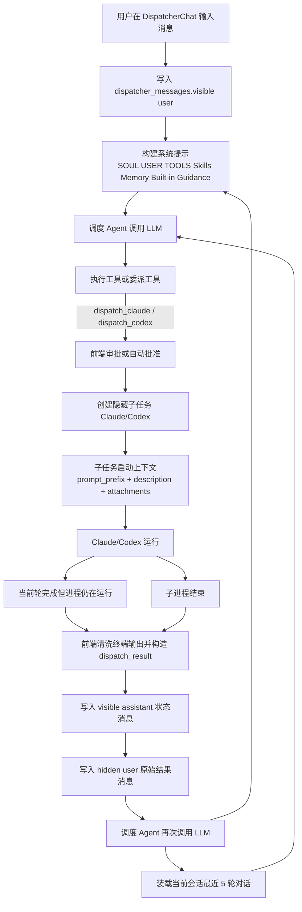

# 调度 Agent 运行链路与上下文管理分析

本文说明当前仓库中调度 Agent、Claude/Codex 子任务、以及多轮调度时的上下文注入与累积方式，并评估当前实现的精准度与上下文膨胀风险。

## 1. 结论摘要

当前实现的核心特点是：

1. 调度 Agent 的 LLM 上下文由两部分组成：
   - 每轮动态构建的系统提示
   - 当前 dispatcher 会话下最近 5 轮对话的持久化消息

2. Claude/Codex 子任务不是继承调度 Agent 全量上下文，而是只拿到：
   - 项目级 `prompt_prefix`
   - 调度 Agent 生成并经用户批准的 `description`
   - 可选附件图片路径

3. 子任务结果回流到调度 Agent 时，会先提炼“状态 + 关键终端片段”的核心摘要，再作为一条隐藏 `user` 消息重新注入 LLM 历史。

4. 多轮调度时，上下文精准度的优点是会话隔离明确、回流信息更聚焦；缺点是如果单轮输出本身很长，或者最近 5 轮都较重，仍然会发生上下文膨胀。

5. 当前最大的膨胀点仍然是“子任务终端输出回流”，但相比之前，过程性 assistant/tool 噪音已经不再进入 LLM 热上下文，回流内容也改成了核心摘要。

## 2. 关键代码位置

- 调度 Agent 主循环：`src-tauri/src/agent/runtime.rs`
- 调度会话持久化与历史装载：`src-tauri/src/agent/db.rs`
- 调度系统提示拼装：`src-tauri/src/agent/prompt.rs`
- 调度工具集合：`src-tauri/src/agent/tools/mod.rs`
- 委派 Claude/Codex 工具：`src-tauri/src/agent/tools/delegation.rs`
- 子任务启动：`src-tauri/src/task_runtime/pty.rs`
- 子任务 session watcher / idle 检测：`src-tauri/src/task_runtime/session.rs`
- 前端调度结果回注：`src/components/DispatcherChat.tsx`
- 前端子任务状态监听与结果拼装：`src/components/ProjectPage.tsx`
- 终端输出清洗：`src/utils/ansiStrip.ts`

## 3. 总体运行图



## 4. 调度 Agent 的上下文是如何构成的

### 4.1 每一轮 LLM 调用的 messages 结构

调度 Agent 在 `run_llm_loop()` 中每次调用 LLM 都会重新构建消息数组：

1. 第一条永远是 `system` 消息
2. 后面追加 `load_llm_history(workspace_id)` 返回的历史消息

也就是说，当前轮不是“增量上下文”，而是“系统提示 + 当前会话最近 5 轮对话重放”。

### 4.2 系统提示的内容

系统提示由以下内容拼接而成，且每轮都会重新读取：

1. `~/.jkcodingagent/SOUL.md`
2. `~/.jkcodingagent/USER.md`
3. `~/.jkcodingagent/TOOLS.md`
4. `~/.jkcodingagent/skills/*/SKILL.md`
5. `~/.jkcodingagent/memory/MEMORY.md`
6. 内置调度规则

这意味着：

- 调度策略、工具说明、个性、长期记忆会在每轮完整注入
- skills 越多、`MEMORY.md` 越长，系统提示越容易膨胀

### 4.3 历史消息的来源

历史消息来自 SQLite 表 `dispatcher_messages`，不是前端内存态。

这里的 `workspace_id` 虽然名字叫 workspace，但在 dispatcher 这条链路里，实际承载的是前端传入的 `sessionId`。
也就是说：

- 一个项目可以有多个 dispatcher 会话
- 每个会话各自拥有独立的历史消息
- 当前轮只会注入“当前 sessionId 对应的消息”，不会混入同项目下其他会话

会进入 LLM 历史的消息类型包括：

| 类型 | role | visible | 是否进入 LLM |
|---|---|---:|---:|
| 用户输入 | `user` | 是 | 是 |
| 普通回复 | `assistant` | 是 | 是 |
| assistant 工具调用记录 | `assistant` + `tool_calls_json` | 是 | 是 |
| tool 结果 | `tool` | 是 | 是 |
| 子任务结果回注 | `user` | 否 | 是 |

关键点：

- `visible = 0` 的隐藏消息不会出现在前端聊天列表中
- 但 `load_llm_history()` 没有按 `visible` 过滤，所以隐藏消息仍然进入 LLM

这就是“前端看不见，但模型能看到”的主机制。

## 5. Claude/Codex 子任务的上下文如何注入

### 5.1 子任务不是继承调度会话全量历史

调度 Agent 触发 `dispatch_claude` 或 `dispatch_codex` 后，前端会创建一个真实子任务。这个子任务的 prompt 不是“调度历史全文”，而是：

1. 调度 Agent 生成的 `description`
2. 如果审批弹窗里用户改过，则使用用户改过的 `description`
3. 项目级 `prompt_prefix`
4. 可选图片附件路径

最终在 `run_task()` 中合成为：

```text
final_prompt = prompt_prefix + "\n" + description + optional attachments
```

这意味着：

- 子任务上下文非常聚焦
- 调度 Agent 之前的完整消息历史不会自动传给 Claude/Codex
- 真实执行质量高度依赖 dispatcher 生成的 `description` 是否足够自包含

### 5.2 当前子任务上下文的优点

- 避免把调度噪音直接带进执行代理
- Claude/Codex 看到的是偏执行导向的任务说明
- 对长会话更友好，不会直接继承 dispatcher 的全量历史

### 5.3 当前子任务上下文的风险

- 如果 `description` 漏掉约束、背景、文件路径、验证方式，执行代理会缺上下文
- 调度 Agent 没有自动携带“关键证据摘要”模板时，委派质量强依赖 LLM 当轮发挥

## 6. 子任务结果是如何回流给调度 Agent 的

子任务结果回流有两条路径。

### 6.1 路径 A：当前轮完成但子进程未退出

后端 session watcher 在检测到当前轮完成且没有等待用户输入时，会发出 `dispatcher-subprocess-idle` 事件。

前端收到后会：

1. 取到本轮输出 `output`
2. 用 `cleanTerminalOutput()` 清洗 ANSI 和多余空行
3. 从终端输出中提炼关键片段
4. 拼成核心摘要后再注入 dispatcher

```text
{Claude|Codex} 当前轮次已完成，子进程仍在运行，可继续注入后续指令。

终端输出：
{cleaned}
```

然后调用 `dispatcher_continue_after_dispatch()`。

### 6.2 路径 B：子进程退出

当前端监听到子任务的 `task-status` 变成 `done/failed/cancelled` 时，会：

1. 从 terminal restore state 取整段可恢复输出
2. 拼接 `initialSnapshot + initialData`
3. 调用 `cleanTerminalOutput()`
4. 构造成：

成功时：

```text
{Claude|Codex} 子进程已退出，本轮执行已结束。

终端输出：
{cleaned}
```

失败或取消时：

```text
{Claude|Codex} 子进程已结束 (status: failed|cancelled)。

终端输出：
{cleaned}
```

然后同样调用 `dispatcher_continue_after_dispatch()`。

### 6.3 回流到调度 Agent 后会写入哪些消息

`continue_after_dispatch()` 会按顺序写两条消息：

1. 一条 `visible assistant` 状态消息
2. 一条 `hidden user` 原始结果消息

例如：

可见 assistant：

```text
🔄 子任务当前轮次已完成，子进程仍在运行，执行结果已同步供后续分析。
```

隐藏 user：

```text
[系统通知] 子任务当前轮次已完成，但子进程仍在运行，可继续注入后续指令，也可在确认无需继续后主动退出。请先分析执行状态，再决定下一步：

Claude 当前轮次已完成，子进程仍在运行，可继续注入后续指令。

终端输出：
...
```

这条隐藏 `user` 消息就是下一轮 LLM 最直接的新输入，但它现在是“摘要化回流”，不再是整段终端输出原文。

## 7. 多轮会话、多轮调度时的上下文累积

### 7.1 一次委派通常会增加多少消息

一次“发起 Claude/Codex 子任务 + 等待回流”的典型最少新增消息大致如下：

1. assistant 工具调用记录
2. tool 消息：`[Claude 子任务已提交审查] ...`
3. assistant 消息：`已提交/已自动批准子任务，等待执行`
4. assistant 消息：`子任务当前轮次已完成 / 子进程已结束`
5. hidden user 消息：完整回流结果

如果中间还发生继续注入：

6. assistant 工具调用记录
7. tool 消息：`[已发送后续指令到 Claude 会话] ...`
8. assistant 消息：`已向 Claude 发送后续指令，等待执行`
9. assistant 消息：下一次状态同步
10. hidden user 消息：下一次完整输出

因此，多轮调度时消息数仍会增长，但进入 LLM 的内容已经尽量偏向高价值语义消息。

### 7.2 最后一轮输入给调度 Agent 的信息，具体包含什么

在多轮调度之后，调度 Agent 最后一轮真正收到的 LLM 输入包含：

1. 当前系统提示
2. 当前 `workspace_id` 对应会话下最近 5 轮对话的消息

在这 5 轮对话窗口中，通常会包含：

1. 原始用户需求
2. 之前几轮 dispatcher 自己的分析和结论
3. assistant 的工具调用记录
4. tool 的执行结果
5. 已提交子任务、等待执行、已发送后续指令、已同步执行结果等过程性提示
6. 多个 Claude/Codex 子任务的终端输出回流内容
7. 最后一条最新的隐藏 `user` 消息，也就是最近一个子任务结果

如果把“最后一轮最关键的新注入内容”单独抽出来，它的结构是：

```text
[系统通知] {round_completed|process_done|process_failed|process_cancelled 对应的中文说明}

{Claude|Codex} {当前轮完成或子进程退出说明}

终端输出：
{cleanTerminalOutput(raw_output)}
```

如果在这之前调度器还做过 `continue`，那么这条消息前面往往还会存在：

- `[已发送后续指令到 Claude 会话] 指令: ...`
- `📨 已向 Claude 发送后续指令，等待执行...`

所以最后一轮输入并不只是“最新结果”，而是“当前会话最近 5 轮对话中的最新回流摘要 + 仍然留在窗口内的必要历史”。

### 7.3 多代理多轮交织时的上下文形态

如果先调 Claude，再继续 Claude，再调 Codex，再继续 Codex，最终历史会呈现这种交织结构：

```text
user: 原始需求
assistant: 调查
assistant(tool_calls): dispatch_claude
tool: 子任务已提交审查
assistant: 等待 Claude
assistant: Claude 当前轮已完成
user(hidden): Claude 输出 #1
assistant(tool_calls): continue_claude_session
tool: 已发送后续指令
assistant: 等待 Claude
assistant: Claude 子进程结束
user(hidden): Claude 输出 #2
assistant: 分析 Claude 结果
assistant(tool_calls): dispatch_codex
tool: 子任务已提交审查
assistant: 等待 Codex
assistant: Codex 子进程结束
user(hidden): Codex 输出 #1
assistant: 最终分析
```

从模型角度看，这些内容全部混在同一个会话历史里。

## 8. 当前实现的精准度评估

### 8.1 优点

1. 证据保真度高
   - 终端输出是原始回注，不是二次总结
   - 对调试、报错、栈追踪、构建日志保留较完整

2. 调度和执行上下文分离得比较好
   - Claude/Codex 子任务不直接继承 dispatcher 全量历史
   - 执行代理拿到的是偏任务化、自包含的 prompt

3. session 级隔离是清晰的
   - `workspace_id` 实际就是当前 dispatcher 的 `sessionId`
   - 前端继续注入时会按 `sessionId + agent` 路由到当前交互子进程

4. 对终端输出做了基础清洗
   - 去掉 ANSI
   - 收敛空行
   - 超长时保留末尾，优先保留最近输出

### 8.2 不足

1. 结果回流缺少结构化摘要
   - 目前回注的是“状态说明 + 原始终端输出”
   - 没有提炼“本轮完成了什么 / 未完成什么 / 风险是什么 / 建议下一步是什么”

2. 过程噪音已做一轮过滤，但仍不算完全语义压缩
   - `已提交审查`
   - `等待执行`
   - `已发送后续指令`
   - `执行结果已同步`
   这类流程性 assistant/tool 消息已经不再进入 LLM 热上下文
   - 但单轮回流摘要里，如果关键片段较长，仍会占用不少上下文

3. 同一事实仍有一定重复表达
   - 可见 assistant 状态消息会保留给 UI
   - 隐藏 user 消息里仍会带系统通知前缀
   - 但真正进入 LLM 的内容已经偏向“状态 + 关键片段摘要”

4. 历史截断规则不够语义化
   - 现在只保留最近 5 轮对话
   - 没有按“重要度”或“阶段完成度”做摘要压缩
   - 如果最近 5 轮里过程噪音过多，仍可能挤掉更早但关键的背景

5. 系统提示每轮全量重读 skills 和 memory
   - 如果 skills 较多或 `MEMORY.md` 很长，会持续占用上下文预算

## 9. 当前实现的膨胀风险评估

### 9.1 最大膨胀源

最大膨胀源是子任务终端输出回流，不是普通工具输出。

原因：

1. 普通工具输出会被 `ToolRegistry` 通过 `max_result_chars = 16000` 截断
2. 子任务结果回流发生在前端，不经过 `ToolRegistry`
3. 虽然现在会先做“关键片段摘要”，但摘要的原材料仍来自较长终端输出

也就是说，最大的风险已经从“整段原始输出直接注入”下降为“长输出导致摘要片段仍然偏重”。

### 9.2 典型膨胀路径

当出现以下场景时膨胀会很明显：

1. Claude 连续多轮调试或安装依赖
2. Codex 进行大规模重构并多次编译/测试
3. 终端输出包含长测试日志、构建日志、静态检查报告
4. 子任务多轮 `continue`
5. skills 和 memory 自身也较长

### 9.3 最近 5 轮对话窗口的副作用

当前已经不是“最近 500 条消息”硬裁剪，而是“最近 5 轮对话”窗口。

副作用包括：

1. 如果早期但关键的背景不在最近 5 轮里，仍然会被裁掉
2. 如果单轮对话里带有长日志，这一轮本身仍然可能很重
3. 目前仍缺少语义摘要压缩，所以窗口虽然更小，但单轮密度依旧可能偏高

## 10. 对“最后一轮输入”的准确描述

如果当前正处于某个子任务完成后的再分析阶段，那么最后一轮真正发给调度 Agent 的消息数组可以抽象成：

```text
messages = [
  system: build_system_prompt(),
  ...recent dispatcher history,
  assistant: "🔄/✅/⚠️/⏹️ 子任务状态同步消息",
  user(hidden): "[系统通知] ...\n\n{Claude|Codex} ...\n\n终端输出：\n{cleaned_output}"
]
```

其中：

- `recent dispatcher history` 里已经包含之前多轮的用户消息、分析、工具调用、tool 结果、等待提示、历史回流结果
- 最后一条 `user(hidden)` 才是本轮最直接的新证据
- 这条消息对调度 Agent 来说是“新用户输入”，即使用户本人并没有再次输入

## 11. 当前设计是否精准

结论是：

- 对“保留原始证据”这件事，当前设计是精准的
- 对“只保留决策所需上下文”这件事，当前设计是不精准的

更具体地说：

1. 它擅长把真实执行结果带回来
2. 但不擅长把执行结果压缩成高密度决策材料
3. 因此短会话表现通常不错
4. 长会话、多轮调度、多代理交织后，噪音和膨胀问题会越来越明显

## 12. 改进方向建议

如果后续要优化上下文管理，优先级建议如下：

1. 为子任务结果回流增加结构化摘要层
   - 本轮完成事项
   - 失败点或阻塞点
   - 关键证据
   - 建议下一步

2. 将“原始终端输出”改为双层注入
   - 短摘要进入主历史
   - 长原始输出进入附件或只在必要时二次检索

3. 压缩过程消息
   - `等待执行`
   - `已同步`
   - `已发送后续指令`
   这类消息可以不进入 LLM 历史，或只保留最后一次

4. 对旧轮次做阶段性摘要
   - 一轮 Claude 完成后，把“过程轨迹”压缩成一条阶段总结
   - 再把原过程消息移出热上下文

5. 为 dispatcher 历史做重要度裁剪，而不是单纯按条数裁剪

## 13. 一句话结论

当前实现的上下文管理是“高保真、低压缩、重证据、轻整理”的设计。短链路下效果直接，多轮调度下容易膨胀；真正决定后期稳定性的瓶颈，不在委派动作本身，而在子任务结果回流时缺少结构化压缩。
