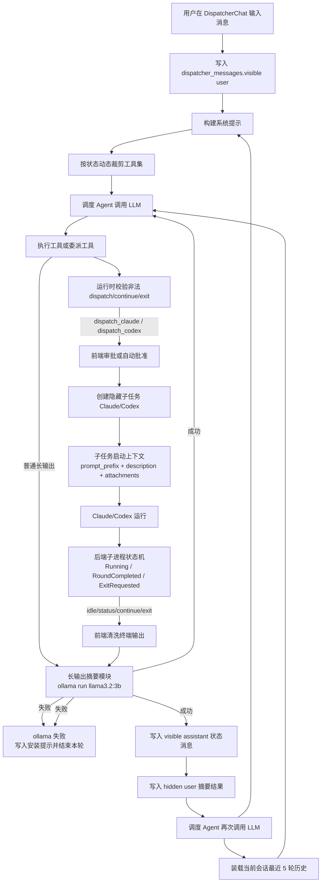
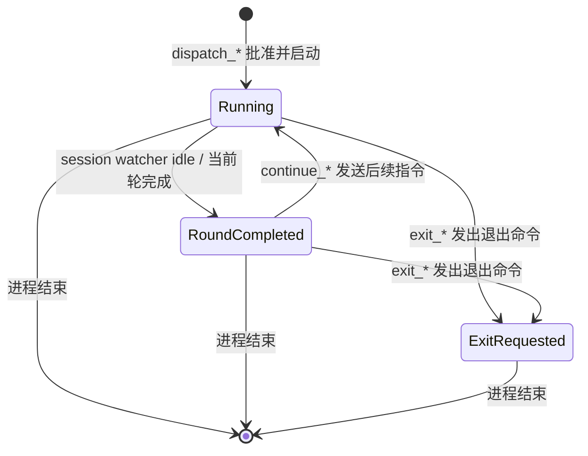

# 调度 Agent 运行链路与上下文管理分析

本文基于当前仓库实现，说明 Dispatcher Agent、Claude/Codex 子任务、多轮调度时的上下文注入方式，以及最新的长输出摘要策略。

当前文档特别覆盖以下新行为：

- 普通长工具输出和子任务长回流结果都会走统一摘要模块
- 摘要强依赖本地 `ollama run llama3.2:3b`
- 不再使用关键词提取、截断拼接等启发式降级摘要
- 只要 `ollama` 不可用、模型未拉取、命令超时或执行失败，就会直接提示安装并结束当前轮次
- 调度器现在维护后端权威子进程状态机，不再只靠聊天历史推测 Claude/Codex 是否仍然活跃
- 工具暴露改为按当前运行态动态裁剪，并在执行时再次校验，避免重复 `dispatch_*` / `continue_*` / `exit_*`

## 1. 结论摘要

当前实现的核心特点如下：

1. 调度 Agent 的 LLM 上下文仍然由两部分组成：
   - 每轮动态构建的系统提示
   - 当前 dispatcher 会话最近 5 轮对话的持久化消息

2. Claude/Codex 子任务仍然不会继承调度 Agent 全量历史，只会拿到：
   - 项目级 `prompt_prefix`
   - 调度 Agent 生成并经用户批准的 `description`
   - 可选图片附件路径

3. 普通工具输出和子任务回流结果在长度超过 100 字符时，会强制走 `ollama run llama3.2:3b` 做结构化中文摘要。

4. 当前实现已经移除了原先基于关键词、关键行提取、截断片段的降级摘要逻辑。

5. 一旦 `ollama` 调用失败，当前轮不会继续分析，也不会回退到旧摘要方案，而是直接向会话写入安装提示并结束本轮。

6. Dispatcher 现在会为每个 session 维护权威子进程运行态：`Running`、`RoundCompleted`、`ExitRequested`。

7. 同一个 session 中，如果某个 agent 已有活跃子进程，则不会再向模型暴露同 agent 的 `dispatch_*` 工具；即使模型仍试图调用，后端也会拒绝执行。

8. 这意味着当前上下文管理从“高保真、轻整理”转成了“严格语义摘要 + 后端权威状态机 + 强依赖本地摘要基础设施”的设计。

## 2. 关键代码位置

- 调度 Agent 主循环：`src-tauri/src/agent/runtime.rs`
- 调度会话持久化与历史装载：`src-tauri/src/agent/db.rs`
- 调度子进程状态同步命令：`src-tauri/src/agent/commands.rs`
- 调度系统提示拼装：`src-tauri/src/agent/prompt.rs`
- 调度工具集合：`src-tauri/src/agent/tools/mod.rs`
- 动态工具定义裁剪：`src-tauri/src/agent/tools/registry.rs`
- 委派 Claude/Codex 工具：`src-tauri/src/agent/tools/delegation.rs`
- 统一摘要模块：`src-tauri/src/agent/summary.rs`
- 子任务启动：`src-tauri/src/task_runtime/pty.rs`
- 子任务 session watcher / idle 检测：`src-tauri/src/task_runtime/session.rs`
- 前端调度结果回注：`src/components/DispatcherChat.tsx`
- 前端子任务状态监听与结果拼装：`src/components/ProjectPage.tsx`
- 终端输出基础清洗：`src/utils/ansiStrip.ts`

## 3. 总体运行图



## 4. 调度 Agent 的上下文是如何构成的

### 4.1 每一轮 LLM 调用的 `messages` 结构

调度 Agent 在 `run_llm_loop()` 中每次都会重新构建消息数组：

1. 第一条永远是 `system`
2. 后面追加 `load_llm_history(workspace_id)` 返回的历史消息

因此当前轮不是增量上下文，而是：

```text
system prompt + 当前 session 最近 5 轮持久化对话
```

### 4.2 系统提示的内容

系统提示每轮都会重新拼装，来源包括：

1. `~/.jkcodingagent/SOUL.md`
2. `~/.jkcodingagent/USER.md`
3. `~/.jkcodingagent/TOOLS.md`
4. `~/.jkcodingagent/skills/*/SKILL.md`
5. `~/.jkcodingagent/memory/MEMORY.md`
6. 内置调度规则

这意味着：

- 调度策略、工具说明、个性、长期记忆每轮完整注入
- `skills` 越多、`MEMORY.md` 越长，系统提示仍然会持续占用预算

### 4.3 历史消息的来源

历史消息来自 SQLite 表 `dispatcher_messages`。

这里的 `workspace_id` 在 Dispatcher 链路中实际承载的是前端传入的 `sessionId`，因此：

- 一个项目可以有多个 dispatcher 会话
- 每个会话历史相互隔离
- 当前轮只会注入当前 `sessionId` 对应的消息

会进入 LLM 历史的消息类型包括：

| 类型 | role | visible | 是否进入 LLM |
|---|---|---:|---:|
| 用户输入 | `user` | 是 | 是 |
| 普通回复 | `assistant` | 是 | 是 |
| assistant 工具调用记录 | `assistant` + `tool_calls_json` | 是 | 是 |
| tool 结果 | `tool` | 是 | 是 |
| 子任务结果回注 | `user` | 否 | 是 |

关键点：

- `visible = 0` 的隐藏消息不出现在前端聊天列表中
- 但 `load_llm_history()` 不会过滤 `visible`
- 所以隐藏消息仍然进入模型上下文

### 4.4 新的后端权威状态来源

除了聊天历史，当前 Dispatcher 还维护一份不经过 LLM 推理的后端权威运行态。

这份状态由后端内存中的子进程注册表维护，前端通过显式命令同步：

- 子任务批准并启动后：注册为 `Running`
- session watcher 发出 idle 后：标记为 `RoundCompleted`
- 调度器继续注入后续指令后：回到 `Running`
- 调度器发出退出命令后：标记为 `ExitRequested`
- 子进程真正结束后：从注册表移除

这意味着：

- “Claude 是否还活着”不再只靠聊天历史推测
- “当前是不是应该继续 / 退出 / 重新 dispatch”也不再只靠模型自由理解
- 后端现在拥有一份独立于聊天消息的权威运行态

## 5. Claude/Codex 子任务的上下文如何注入

### 5.1 子任务不是继承调度会话全量历史

调度 Agent 触发 `dispatch_claude` 或 `dispatch_codex` 后，前端创建真实子任务。这个子任务拿到的不是调度历史全文，而是：

1. 调度 Agent 生成的 `description`
2. 若审批弹窗中被用户修改，则使用修改后的 `description`
3. 项目级 `prompt_prefix`
4. 可选图片附件路径

最终在 `run_task()` 中合成为：

```text
final_prompt = prompt_prefix + "\n" + description + optional attachments
```

### 5.2 当前子任务上下文的优点

- 执行上下文聚焦，不会把调度噪音直接带进 Claude/Codex
- 子任务 prompt 更偏执行说明，而不是会话流水账
- 对长会话更友好，不会直接继承 dispatcher 全量历史

### 5.3 当前子任务上下文的风险

- 如果 `description` 缺约束、文件路径、验证方式，执行代理仍可能上下文不足
- 当前并不会自动把 dispatcher 历史中的关键证据拼成一份显式 briefing

## 6. 后端权威子进程状态机

### 6.1 为什么要引入状态机

旧实现的问题在于：

- 前端知道 Claude/Codex 子进程还活着
- 但后端 LLM 主循环并没有同等权威的状态
- 模型只能从聊天历史、过程消息和摘要里“猜”当前 agent 是否还处于活跃态

于是就会出现这类问题：

- Claude 明明已经完成当前轮，但模型又重新 `dispatch_claude`
- 已经调用过 `exit_claude_session`，模型又再次 exit
- 同一个 agent 在同一个 session 内出现并行或重复调度

### 6.2 当前状态枚举

当前后端状态机只保留 3 个核心态：

1. `Running`
   - 子进程正在活跃运行
   - 当前轮尚未形成供调度器重新决策的稳定节点

2. `RoundCompleted`
   - 子进程仍然活着
   - 但当前轮已经完成
   - 当前应在“继续 / 退出 / 直接回复用户”之间做决策

3. `ExitRequested`
   - 调度器已经发出退出命令
   - 当前只能等待真实进程结束
   - 不应再继续、退出或重新调度同 agent

### 6.3 状态转移链路



### 6.4 为什么它比旧实现更稳定

因为现在不是“让模型从聊天记录自己推测世界状态”，而是“系统先声明当前世界状态，再只开放合法动作”。

稳定性来自 3 层约束：

1. 单一事实源
   - 当前 agent 是否有活跃子进程，以后端注册表为准
   - 不再以聊天历史为准

2. 动态工具可见性
   - 若某个 session 已有活跃 `claude` 子进程，则不再向模型暴露 `dispatch_claude`
   - 若 `claude` 处于 `RoundCompleted`，则只暴露 `continue_claude_session` 和 `exit_claude_session`
   - 若 `claude` 处于 `ExitRequested`，则 Claude 相关委派工具全部隐藏

3. 运行时硬校验
   - 即使模型因为历史或推理误差仍然选择了非法动作
   - 后端在执行前也会再校验一次并拒绝
   - 因此非法状态迁移不会真正落地

### 6.5 这解决了什么问题

这套状态机主要解决了以下重复调度问题：

- Claude 当前轮完成后被再次 `dispatch_claude`
- 已经发过退出命令后重复 `exit_claude_session`
- 子进程仍活着时重新创建同 agent 新子任务

也就是说，当前系统已经从“prompt 约束”升级为“状态机约束”。

## 7. 普通工具输出如何进入上下文

### 7.1 当前普通工具结果的处理方式

普通工具调用返回原始结果后，Dispatcher 主循环会分两类处理：

1. 协议型工具
   - `dispatch_claude`
   - `dispatch_codex`
   - `continue_claude_session`
   - `continue_codex_session`
   - `exit_claude_session`
   - `exit_codex_session`

   这些工具优先用于协议解析，不走摘要模块。

2. 非协议型工具
   - `read_file`
   - `write_file`
   - `edit_file`
   - `list_dir`
   - `glob`
   - `exec`
   - `message`

   这些工具的返回值在长度超过 100 字符时，会先送进 `src-tauri/src/agent/summary.rs`，由本地 `ollama run llama3.2:3b` 生成结构化中文摘要，再写入：
   - `ToolFinished` 事件
   - `dispatcher_messages` 的 `tool` 消息

### 7.2 摘要失败时的行为

当前实现不再降级。

一旦 `ollama` 执行失败，当前轮会立即：

1. 写入一条 `visible assistant` 消息
2. 明确提示需要安装：
   - `ollama`
   - `ollama pull llama3.2:3b`
3. 发出 `Finished` 事件
4. 结束当前轮，不再继续后续 LLM 分析

因此，现在普通工具长输出的可用性依赖于本地 `ollama` 基础设施。

## 8. 子任务结果是如何回流给调度 Agent 的

子任务结果回流仍然有两条路径。

### 8.1 路径 A：当前轮完成但子进程未退出

后端 session watcher 检测到当前轮完成且无需用户输入时，会发出 `dispatcher-subprocess-idle`。

前端收到后会：

1. 取出本轮输出 `output`
2. 用 `cleanTerminalOutput()` 去掉 ANSI、收敛空行、保留较新的尾部片段
3. 构造成：

```text
{Claude|Codex} 当前轮次已完成，子进程仍在运行，可继续注入后续指令。

终端输出：
{cleaned}
```

4. 调用 `dispatcher_continue_after_dispatch()`

### 8.2 路径 B：子进程退出

当前端监听到 `task-status` 变成 `done/failed/cancelled` 时，会：

1. 从 terminal restore state 取整段可恢复输出
2. 拼接 `initialSnapshot + initialData`
3. 调用 `cleanTerminalOutput()`
4. 构造成：

成功时：

```text
{Claude|Codex} 子进程已退出，本轮执行已结束。

终端输出：
{cleaned}
```

失败或取消时：

```text
{Claude|Codex} 子进程已结束 (status: failed|cancelled)。

终端输出：
{cleaned}
```

5. 同样调用 `dispatcher_continue_after_dispatch()`

### 8.3 回流摘要如何生成

`continue_after_dispatch()` 当前的行为是：

1. 先写一条 `visible assistant` 状态消息
2. 判断 `dispatch_result` 长度
3. 若超过 100 字符，则强制调用 `ollama run llama3.2:3b` 做结构化中文摘要
4. 摘要成功后，将
   - 系统通知前缀
   - `ollama` 生成的摘要正文
   拼成一条 `hidden user` 消息写回数据库
5. 然后再继续下一轮 Dispatcher LLM 分析

### 8.4 回流摘要失败时的行为

如果 `ollama` 在这一步失败：

1. 当前不会写入 `hidden user` 回流消息
2. 不会再继续下一轮 LLM 分析
3. 会直接写入一条安装提示并结束当前轮

因此，当前子任务结果回流已经变成“严格依赖语义摘要”的链路，而不是“最好有摘要，没有就退回关键片段”的链路。

## 9. 多轮会话、多轮调度时的上下文累积

### 9.1 一次典型委派会增加哪些消息

一次“发起 Claude/Codex 子任务并等待回流”的典型最少新增消息大致如下：

1. assistant 工具调用记录
2. tool 消息：`[Claude 子任务已提交审查] ...`
3. assistant 消息：`已提交/已自动批准子任务，等待执行`
4. assistant 消息：`子任务当前轮次已完成 / 子进程已结束`
5. hidden user 消息：子任务摘要回流结果

如果中间还发生继续注入，则还会新增：

6. assistant 工具调用记录
7. tool 消息：`[已发送后续指令到 Claude 会话] ...`
8. assistant 消息：`已向 Claude 发送后续指令，等待执行`
9. assistant 消息：下一次状态同步
10. hidden user 消息：下一次子任务摘要回流结果

### 9.2 最后一轮输入给调度 Agent 的关键新内容

在某个子任务完成后的再分析阶段，最后一轮最关键的新输入通常可以抽象为：

```text
[系统通知] ...中文状态说明...

【子任务回流摘要】
- 状态：...
- 已完成：...
- 阻塞/风险：...
- 关键证据：...
- 建议下一步：...
```

也就是说：

- 新输入已经不再是整段终端日志
- 而是 `ollama` 生成的结构化摘要
- 可见状态消息仍保留给 UI
- 真正给模型的新证据主要落在隐藏 `user` 消息里

### 9.3 多代理多轮交织时的上下文形态

如果先调 Claude，再继续 Claude，再调 Codex，历史形态大致会是：

```text
user: 原始需求
assistant: 调查
assistant(tool_calls): dispatch_claude
tool: 子任务已提交审查
assistant: 等待 Claude
assistant: Claude 当前轮已完成
user(hidden): Claude 摘要回流 #1
assistant(tool_calls): continue_claude_session
tool: 已发送后续指令
assistant: 等待 Claude
assistant: Claude 子进程结束
user(hidden): Claude 摘要回流 #2
assistant: 分析 Claude 结果
assistant(tool_calls): dispatch_codex
tool: 子任务已提交审查
assistant: 等待 Codex
assistant: Codex 子进程结束
user(hidden): Codex 摘要回流 #1
assistant: 最终分析
```

## 9. 当前实现的精准度评估

### 9.1 优点

1. 调度上下文和执行上下文仍然分离得比较好
   - Claude/Codex 子任务不直接继承 dispatcher 全量历史
   - 执行代理拿到的是偏任务化、自包含的 prompt

2. 会话级隔离清晰
   - `workspace_id` 实际就是当前 dispatcher 的 `sessionId`
   - 前端继续注入时按 `sessionId + agent` 路由到交互子进程

3. 长输出不再直接灌入热上下文
   - 普通长工具输出走统一摘要模块
   - 子任务长回流结果也走统一摘要模块

4. 子进程状态不再只靠聊天历史推断
   - 后端维护权威运行态
   - 动态工具可见性降低了重复 dispatch / continue / exit 的概率

5. 当前摘要是显式结构化目标
   - 普通工具输出要求保留错误、路径、退出码、数量统计
   - 子任务回流要求保留状态、已完成、风险、关键证据、建议下一步

### 9.2 代价和不足

1. 当前实现强依赖本地 `ollama`
   - 这不是可选增强，而是长输出链路的硬依赖

2. 稳定性从“模型可继续跑”变成“摘要基础设施必须可用”
   - `ollama` 不存在
   - 模型没拉取
   - 命令超时
   - 命令失败
   任一情况都会结束当前轮

3. 当前权威状态机仍然在后端内存里
   - 它比纯自然语言历史稳定很多
   - 但还不是跨重启持久态

4. 短输出与长输出的处理方式现在不对称
   - 短输出保留原文
   - 长输出保留语义摘要
   这有助于压缩上下文，但会牺牲部分原始证据可见性

5. 原始长输出不再有启发式兜底
   - 当前实现明确拒绝“不安全摘要”
   - 也就意味着失败时只能停止，而不是带着近似摘要继续推进

## 10. 当前实现的膨胀风险评估

### 10.1 最大膨胀源是否变化

最大膨胀源仍然是子任务结果回流，但风险形态已经变化：

- 以前的问题是“长终端输出或关键片段仍然太重”
- 现在的问题变成“摘要成功时膨胀显著降低，摘要失败时链路直接停止”

### 10.2 膨胀风险的现状

在 `ollama` 正常可用时：

1. 长工具输出不再直接进入上下文
2. 长子任务回流不再直接进入上下文
3. 单轮上下文密度显著下降

因此，相比旧实现，当前真正的上下文膨胀风险已经明显下降。

### 10.3 新的主要风险

新的主要风险不再是“长日志进上下文”，而是“本地摘要依赖失效导致轮次中止”。

典型失败场景包括：

1. 未安装 `ollama`
2. 未执行 `ollama pull llama3.2:3b`
3. 本地 `ollama` 服务异常
4. 输出太大导致摘要耗时过长而超时
5. 目标机器环境 PATH 配置不完整

## 11. 对“最后一轮输入”的准确描述

如果当前正处于某个子任务完成后的再分析阶段，那么最后一轮真正发给调度 Agent 的消息数组可以抽象成：

```text
messages = [
  system: build_system_prompt(),
  ...recent dispatcher history,
  assistant: "🔄/✅/⚠️/⏹️ 子任务状态同步消息",
  user(hidden): "[系统通知] ...\n\n【子任务回流摘要】\n- 状态：...\n- 已完成：...\n- 阻塞/风险：...\n- 关键证据：...\n- 建议下一步：..."
]
```

如果 `ollama` 在这一轮失败，则不会形成上面的隐藏消息，而会提前结束在：

```text
assistant: 检测到摘要依赖 ollama 执行失败，请安装 ollama 并 pull llama3.2:3b 后重试
```

## 12. 当前设计是否精准

结论是：

- 对“只把决策所需内容压成结构化材料再注入”这件事，当前设计比旧实现更精准
- 对“即使基础设施异常也尽量继续运行”这件事，当前设计刻意不追求宽容

更具体地说：

1. 它更擅长压缩长输出
2. 它更依赖本地摘要基础设施
3. 它用“失败即停止”换取了“拒绝不安全摘要”
4. 它把风险从“上下文膨胀”转移到了“摘要依赖可用性”

## 13. 后续改进方向建议

如果后续继续优化，优先级建议如下：

1. 为 `ollama` 摘要链路补可观察性
   - 单独记录摘要耗时
   - 区分 command not found、model missing、timeout、runtime failure

2. 为原始长输出提供冷存储引用
   - 主历史只留结构化摘要
   - 原始日志通过文件路径、附件或二次检索查看

3. 为不同输出类型设计更细的摘要模板
   - `exec` 偏命令结果
   - `list_dir` 偏结构概览
   - 子任务回流偏任务状态与下一步建议

4. 让前端对“摘要失败而停止”提供更清晰的操作入口
   - 一键检查 `ollama`
   - 一键提示执行 `ollama pull llama3.2:3b`

5. 将当前内存态状态机进一步持久化
   - 当前权威状态仍在后端内存中
   - 若未来要支持更强恢复能力，可考虑将活跃子进程状态落到持久层

6. 继续压缩非关键流程消息
   - `等待执行`
   - `已同步`
   - `已发送后续指令`
   这类消息虽然很多已被过滤出 LLM 热上下文，但仍可进一步做 UI 与历史分层

## 14. 一句话结论

当前实现的上下文管理已经从“高保真、低压缩、允许降级”切换为“统一语义摘要 + 后端权威子进程状态机 + 动态工具可见性 + 运行时硬校验”。只要 `ollama` 正常可用，长输出膨胀问题会明显改善；而状态机则负责把重复 dispatch / continue / exit 这类错误路径从架构层面尽量封掉。
