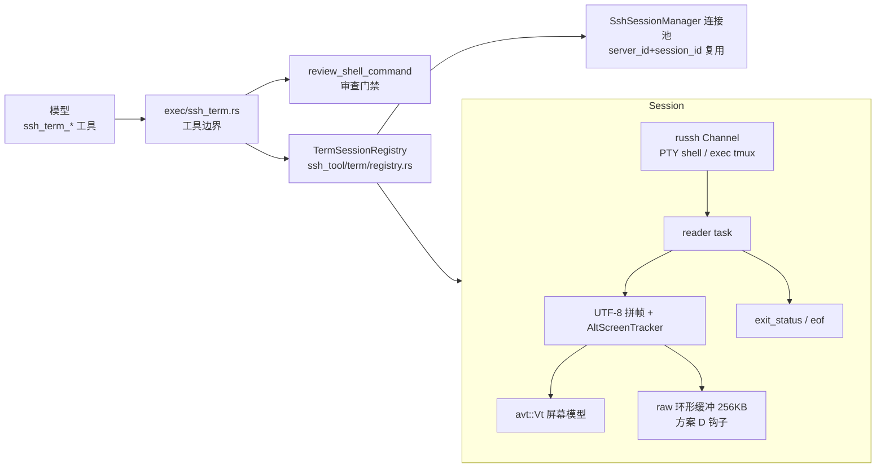

# SSH 交互终端工具组设计（ssh_term_*）

状态：已实施；2026-10-10 第二轮更新：tmux 服务端历史、受能力检测保护的括号粘贴、显式安装入口与分阶段恢复预算。考察基线：2026-10-08。选型：**avt 0.18** 屏幕模型，russh 0.63.3 SSH 通道。§4 为当前工具契约，后文选型与算法示意保留设计背景。

## 1. 背景与目标

`ssh_exec` 走 russh exec channel，stdin 启动时一次写入即 EOF（`command_exec.rs:136-144`），不支持中途喂入；交互检测（`PROMPT_IDLE_SECS=8` / `MAX_SILENT_IDLE_SECS=60`，`command_exec.rs:14-15`、`:245-249`）命中后只能中止并返回 `interactiveBlocked`，引导文案劝模型改写非交互命令。总有一类任务无法非交互化：REPL、全屏程序（top/htop/less/vi）、分步向导、未预见的确认提示。

**目标：把一台真实的远程终端暴露给 Agent**——agent 能打开终端、发送按键、读取屏幕，自主完成「读→决策→写」的交互循环。

**核心原则：tmux 优先、裸 PTY 明示限制。** `ssh_term_open` 默认探测远端 tmux，有则检查同名会话、按需后台创建，再通过 PTY attach。远端会话存活时，断连后同名 open 可恢复，人类可 `tmux attach` 共屏。确认未安装且未显式指定 `tmuxSession` 时才允许裸 PTY，并在 `note` 明确“不保证保活、不能恢复现场”；探测/启动失败报错。avt 负责读屏，不负责保活。返回载荷沿用 snake_case，输入参数 `tmuxSession` 保持既有命名。

**非目标（本期不做）：**

- 前端围观/接管终端（方案 D，留钩子）；
- 人工输入弹窗（方案 C，密码类输入的正解，另立设计）；
- 本地终端工具组（架构同构，先验证 SSH 侧）。

## 2. 核心选型：avt 能力清单（源码实证）

依赖：`avt = "0.18"`（依赖仅 rgb + unicode-width，自研解析器）。以下 API 均逐条核对过 crate 源码：

| 能力 | API | 源码位置 | 我们的用途 |
| --- | --- | --- | --- |
| 构造 | `Vt::builder().size(cols, rows).scrollback_limit(n).build()` | `vt.rs:12-16, 86-105` | 每个终端会话一个 `Vt`，80×24 + 回滚 1000 行 |
| 喂入 | `feed_str(&str) -> Changes` | `vt.rs:20-28` | reader 任务把 channel 字节经 UTF-8 拼帧后喂入 |
| 变更通知 | `Changes { lines: Vec<usize>, scrollback: Box<dyn Iterator<Item=Line>> }` | `vt.rs:119-121` | `lines` = 本次喂入弄脏的行号；`scrollback` = **超出回滚上限被裁掉的行**（归档信号，非"进入回滚的行"） |
| 屏幕快照 | `view() -> Iterator<&Line>` + `Line::text()` | `terminal.rs:636`、`line.rs:324` | **活动缓冲区**的可见行（含全屏程序）；尾随空单元已 trim |
| 回滚+视口 | `lines() -> Iterator<&Line>` | `terminal.rs:640` | 增量读游标的坐标系 |
| 光标 | `cursor() -> Cursor` | `terminal.rs:339` | 辅助判定"停在提示符" |
| resize | `resize(cols, rows) -> Changes` | `vt.rs:41` | 与 russh `window_change` 同步 |
| 状态重建 | `dump() -> String` | `vt.rs:74`、`terminal.rs:1327-1443` | 输出完整 ANSI 重建序列（含主/备缓冲区）——方案 D 前端迟到补帧的钩子 |

**两个已确认的坑，设计已绕开：**

1. **`text()` 只返回主缓冲区**（`terminal.rs:648-650` 显式取 `primary_buffer()`）——快照全屏程序必须用 `view()`，禁止用 `text()`。
2. **无公开备用屏幕查询**（`Terminal::active_buffer_type()` 存在但 `Vt.terminal` 为私有字段）——自行在字节分接层实现 `AltScreenTracker`（见 §5.3）。
3. 备用缓冲区 `gc()` 恒返回空（`terminal.rs:343-354`）——全屏程序不产生回滚裁切事件，不能将其视为 tmux 完整日志；备用屏增量改为两次 read 之间的可见行差分。

## 3. 架构总览



复用而非新建：SSH 连接复用现有 `SshSessionManager.connection_for`（`ssh_tool/mod.rs:397`）；审查复用 `review_shell_command`（`ssh_review.rs:107`）；审计复用 `ssh_audit_log`；取消复用 `ToolInvocationContext.cancel_rx` 传播链。**不新增数据库表、不动 schema、不新增前端契约事件**（v1 工具卡片走既有工具调用 UI）。

模块布局（单文件 ≤500 行纪律）：

| 文件 | 职责 |
| --- | --- |
| `src-tauri/src/ssh_tool/term/mod.rs` | 公共类型（TermId、TermInfo、ReadPayload）+ 错误 |
| `src-tauri/src/ssh_tool/term/registry.rs` | `TermSessionRegistry`：登记/查询/关闭/空闲回收/会话级联清理 |
| `src-tauri/src/ssh_tool/term/session.rs` | `TermSession`：channel 开壳/写入/window_change/关闭、reader task 生命周期 |
| `src-tauri/src/ssh_tool/term/screen.rs` | avt 胶水：UTF-8 拼帧、`AltScreenTracker`、双轨游标（new_lines 算法） |
| `src-tauri/src/agent/rig_ext/tools/exec/ssh_term/` | open/send/read/resize/close/list 工具构造器，参数提取/审查/台账 |
| `src-tauri/src/ssh_tool/term/responses.rs` | 分包查询识别与有界终端协议应答 |
| `src-tauri/src/ssh_tool/term/screen/` | 历史/ANSI 渲染、备用屏差分与屏幕测试 |

## 4. 工具组契约

### 4.1 `ssh_term_open`

```json
{"server_id": "server-4", "session_id": "aikhd-debug", "tmux": "auto", "tmuxSession": "jkagent-install-nginx", "cols": 80, "rows": 24}
```

- `tmux` 默认 `auto`；`required` 要求远端存在 tmux，缺失时在执行 command 前拒绝打开；`off` 强制裸 PTY，不能与 `tmuxSession` 同用，其他值报错。需要保活/恢复/共屏的任务使用 `required`。
- **auto**：同连接临时通道探测 `command -v tmux`。必须取得退出码，EOF 只表示数据结束，不能提前丢掉随后到达的 ExitStatus。通道失败、缺少退出码或超时均报错，不能当作“未安装”。
- 有 tmux 时先 `has-session -t =<name>`，不存在则 `new-session -d -s <name>`，成功后通过已申请的 PTY 执行 `attach-session -t =<name>`。会话名须满足 `jkagent-` + `[A-Za-z0-9_-]{1,48}`。PTY 与 shell/exec 请求须收到服务端确认；启动失败不隐式回退裸 shell。
- `tmuxSession` 缺省自动生成 `jkagent-<随机片段>`；恢复时传回载荷 `tmux_session`。显式指定时要求 tmux 可用。已存在的会话直接 attach；已结束的会话只能同名新建，无法复活旧进程。
- 可选 `command` 始终走审查门禁。auto 且有 tmux 时作为新会话初始命令，单引号编码传参；已有会话只 attach，不重复执行，并在 note 提醒。裸 PTY 时直接 exec。
- `command` 发出后的回执丢失、attach 失败或立即退出，返回 `external_state_unknown`，携带可用的 tmux 会话名，禁止自动重跑。短命令可能已执行完并销毁会话：应先核实副作用和任务结果，不能把“会话不存在”当作“命令未执行”。
- 未安装 tmux 且未指定会话名时允许裸 PTY，note 明示不能恢复现场。需要保活时先显式调用 `ssh_tmux_install`（见 §4.6），再 `ssh_term_open(tmux="required")`；普通 open 不安装软件。不注入 nohup/setsid：它们不能保留控制终端或恢复交互向导；纯后台任务可显式经 ssh_exec 提交并自行记录日志。
- 启动总预算 20 秒；channel、PTY、每条 tmux 模板和最终 attach 分阶段各最多 5 秒，清理另有 1 秒。较慢的探测不会提前耗尽 attach 的单阶段预算。任何可能已执行的 command 仍不自动重试。
- `cols/rows` 缺省 80×24，夹紧 40..200 × 10..60。
- 返回 `{term_id, screen, cursor, tmux_session, exited, exit_code, note}`；`tmux_session=null` 表示裸终端。tmux 模式下 screen 是主要读屏来源。
- 配额：每 server ≤4、全局 ≤16，超限返回可恢复错误并附现有会话清单，引导模型先 close。

### 4.2 `ssh_term_send`

```json
{"term_id": "term_...", "text": "echo ready", "text_mode": "literal", "enter": true, "intent": "检查终端是否就绪"}
```

- **每次 send 都是命令执行**：`text + intent` 一并送 `review_shell_command`；`intent` 为必填（≤200 字符），给审查模型补上下文，同时落 `ssh_audit_log`——没有 intent 的裸按键片段审查模型无法判定。
- **送审载荷附终端现场**：除 `text + intent` 外，附 Vt 当前输入行（光标所在行）与屏幕尾部 5 行——审查模型据此看到真实终端状态而非裸按键碎片（`Y\r` 单看不可判，配合屏幕上的 `Do you want to continue? [Y/n]` 即可裁决），弥补按键流碎片化的审查盲区（§7）。
- `text_mode` 默认 `escaped`：JSON 解码后再进行**单遍**终端转义解析，支持 `\uXXXX`（包括代理对）、ASCII `\xXX` 与 1–3 位八进制 `\0..\177`（`\033` 等价 ESC）、`\r`、`\n`、`\t`、`\e` 等；真实控制字符保持原样。`\u0003` 是 Ctrl-C，`\u001b[A` 是方向键，`\u0002d` 是 tmux detach。CR/LF/CRLF 原样发送，不擅自合并按键。非法转义报错，整次不发送。
- `text_mode="literal"` 不额外解码反斜杠；真实 ESC/TAB/LF/CR 仍是按键，会受远端 readline 解释，并非安全脚本粘贴。复杂脚本使用 `ssh_exec` 的 stdin 或 `ssh_term_open(command)`。escaped 模式中 `\\` 表示字面反斜杠，解析产物不递归解码。
- 可选 `paste=true` 发送 `ESC[200~` / `ESC[201~` 包络，仅在远端已输出 `CSI ?2004h` 启用括号粘贴时允许；送审前和发送前均检查能力，关闭时整次拒绝，不降级为按键。内容不允许包含粘贴起止标记。建议配合 `text_mode="literal"`，避免脚本中的 shell 转义被预先解码。
- 可选 `enter=true`：默认按键模式在未以真实 CR/LF 结尾时追加 CR；粘贴模式始终在结束包络之后追加 CR 提交整段内容。默认不追加。literal 中的字面 `\r` 始终保留，执行命令时不要附加它。
- 送审和发送使用同一份最终文本（含粘贴包络和追加回车），审计用可逆的 JSON 字符串表示真实输入。上限提高至 32000 个 Unicode 字符，与命令审查上限一致（intent 另为 200 字符）；超限整次拒绝，不截断、不自动拆分。长脚本优先 `ssh_exec` 的 stdin 或上传文件后执行。
- **密码红线写进工具描述**：禁止经 send 输入任何口令/密钥；遇到密码提示应改用无交互路径或请用户介入（为方案 C 预留语义）。
- 目标已 `exited` → 返回 `command_failed` 类错误并附 exit_code。
- 返回 `{termId, ok: true, hint}`（send 的既有返回命名保持不变）；回显经 `ssh_term_read` 读取。

### 4.3 `ssh_term_read`

```json
{"term_id": "term_...", "wait_ms": 5000}
```

- `wait_ms`（0..25000）：普通读取默认 0，等待期间任一输出帧到达即返回。
- `wait_for`：1..256 字符、大小写敏感的纯文本子串；对当前 screen 与未读定稿行分别匹配，不拼接重叠数据。存在该参数时 wait_ms 默认 25000，跨输出帧继续等待，返回 `wait_status=matched/timed_out/exited/cancelled`。超时/取消只结束本次读取，不关闭远端终端。匹配可命中当前已有内容，不代表任务成功；全屏程序在两次观察间出现又被抹掉的文本不保证捕获。
- `history_lines`（1..200）+ `history_offset`（默认 0）：读取视口之前的历史。offset 跳过最近 N 行，页内旧→新排列，按 `history.next_offset` 向更早翻页；每页最多 12000 字节，返回 `source/available_lines/truncated`。`source="terminal"` 是裸 PTY 本地缓冲（最多 1000 行，关闭即释放）；`source="tmux"` 经独立只读通道调用 `display-message` + `capture-pane`，读取指定会话当前活动 pane 的服务端历史，无需进入 copy-mode。tmux 历史上限由远端 history-limit 决定，随远端会话保留；查询失败报错，不伪装为空历史。持续输出时 offset 是相对位置，不保证跨调用的静态快照。
- `include_ansi=true`：附加 `screen_ansi`，同时使 `history.lines` 保留 ANSI 样式；`screen/new_lines` 始终纯文本。样式从 avt 单元格重建，只输出 SGR，不回传 OSC/剪贴板/查询控制序列。
- 恒返回双轨载荷（模型无需做模式选择，也补偿了 avt 无备用屏查询的缺口）：

```json
{
  "term_id": "term_...",
  "new_lines": ["自上次 read 以来新增的行"],
  "new_lines_kind": "completed_lines",
  "screen": "当前可见屏幕纯文本（含全屏程序渲染结果）",
  "cursor": {"row": 12, "col": 5},
  "alt_screen": false,
  "tmux_session": null,
  "exited": false, "exit_code": null,
  "idle_ms": 1530,
  "awaiting_input": true,
  "input_hint": "疑似停在 shell/REPL 提示符等待输入；这是读屏启发式判断，不能证明前一条命令成功",
  "truncated": false,
  "note": null
}
```

- `new_lines_kind=completed_lines` 为主屏定稿行；`screen_changes` 为备用屏两次读取间新增或改写的可见行，通过有序差分避免滚动时重报旧行。位置变化、删除和读取间已消失的内容以 screen/外部日志为准，不承诺完整日志。open 首屏、send/resize 状态检查不消费未读输出。
- `new_lines` 上限 200 行 / 12000 字节，超限置 `truncated=true`；待取队列也有上限，不能把 screen 当作完整永久日志。
- `awaiting_input=true` 仅表示当前光标行匹配密码/确认/less 的 press RETURN/Vim/Nano/shell/REPL 提示且至少 1 秒没有输出。常见 y/n、yes/no、回车提示的 `input_hint` 提供应答模板；主机指纹先要求可信渠道核对，不套用普通确认模板。false 不证明程序无需输入，纯静默不触发判断；模板不自动发送，每次 send 仍经审查。
- 凭据提示只提示改用 `ssh_exec sudo=true` 等非交互路径或用户介入，禁止通过 send 输入口令；passwd/mysql -p 等不能靠本工具安全代填。
- `exit_code` 是顶层 shell、直接 exec 进程或 tmux client 的退出码，未知为 null；不表示 shell 中每条命令的状态。PTY 内 stdout/stderr 已合流，无法可靠拆回。需要逐命令退出码和分流时用 `ssh_exec`。

### 4.4 `ssh_term_close`

`channel.close()` 5s 宽限，移除注册表项，审计落库。返回与 open 相同的 snake_case 载荷；已移除的 term_id 再 close 返回 not_found。

tmux 会话下 close 语义分档（可选参数 `killTmuxSession`，默认 false）：

- **detach（默认）**：仅断开 agent 侧 attach channel；远端 tmux 会话仍存活时同名 open 可恢复。若最后一个程序已退出，不能承诺现场仍在。
- **kill（`killTmuxSession=true`）**：先经临时 channel exec `tmux kill-session -t =<tmuxSession>`（模板命令 + 白名单会话名，免审落审计，§7）再关闭，彻底回收远端现场。

### 4.5 `ssh_term_list`

可选 `server_id` 过滤，返回 `{terms: [{term_id, server_id, session_id, tmux_session, created_at, last_activity_at, exited}]}`。供模型在长跑/重载后重新发现自己打开的终端，也供超限时报错附清单；`tmuxSession` 让模型在终端被空闲回收 / 断连后仍能凭同名 open 恢复远端现场（远端遗留的 tmux 会话可用一条 ssh_exec `tmux ls` 自助枚举）。

### 4.6 `ssh_tmux_install`

```json
{"server_id": "server-4", "session_id": "aikhd-debug", "sudo": true, "timeout_secs": 300}
```

显式安装入口。固定脚本先检查 tmux，已安装则返回版本；缺失时选择 apt-get 或 dnf 非交互安装，最后验证 `tmux -V`。不自动 update/upgrade，不支持的包管理器明确报错。`sudo` 默认 false：root 或已有权限时无需开启；需要提权时复用 `ssh_exec` 已配置的凭据路径，不在终端中输入密码。

执行完全委托现有 `ssh_exec`，共享命令审查、提权确认、取消、超时、审计和失败分类，审计显示实际安装命令。参数仅允许 server_id/session_id/sudo/timeout_secs，不能覆盖 command 或 stdin。安装完成后再调用 `ssh_term_open` 并指定 `tmux="required"`；安装不会恢复此前已消失的裸 PTY 进程。超时/断连的安装结果可能未知，先查询状态，不自动重跑。

## 5. 数据通路实现要点

### 5.0 终端查询应答

reader 在同一 SSH channel 回写 CPR（`CSI 6n` / `CSI ?6n`）、DSR 状态（`CSI 5n`）、DA1（`CSI c` / `CSI 0c`）、字符尺寸（`CSI 18t`）。每字符先更新屏幕，再在查询结束位置取得光标与尺寸，避免一帧多次查询都误用帧末坐标。UTF-8、CSI 分包均保留解析状态；回复在锁外写入，超时或回复量超限明确关闭通道并返回 note。

`CSI ?25h/l` 是光标显隐设置，由屏幕模型处理，不应回写。OSC/DCS 等字符串中的伪造查询不触发应答；不实现剪贴板、Sixel、鼠标、串口等额外协议。CPR 当前使用可见屏幕坐标；滚动区域 DECOM 原点模式的相对坐标尚未覆盖。

协议应答只包含确定的终端状态，不是业务自动应答。y/n、主机指纹与密码提示仍由工具循环判断：`read(wait_for)` → `send(text, intent)`，每次输入单独审查；不提供自动接受指纹或代填密码的模板。

### 5.1 开壳序列（russh 0.x）

```
connection_for(server_id, session_id)            // 复用连接池，锁外建连；TermSession 持有返回的 Arc<SshConnection> 强引用
→ （tmux auto 路径）临时 channel：exec "command -v tmux" 探测，即起即收
→ handle.channel_open_session().await
→ channel.request_pty(false, "xterm-256color", cols, rows, 0, 0, &[]).await
→ channel.request_shell(false).await  /  channel.exec(true, tmux_new).await  /  channel.exec(true, command).await
→ spawn reader task → 登记 TermSession
```

写入 `channel.data(bytes)`；缩放 `channel.window_change(cols, rows, 0, 0)` + `vt.resize()` 两侧同步；EOF/关闭 `channel.eof()` / `channel.close()`。签名已对照锁定的 russh 0.63.3 核对（`data<R: AsyncRead + Unpin>`，`&[u8]` 直接可用）。

两个实施须知：PTY 下无独立 stderr（远端 stderr 复用 PTY 主流），tmux/command 的 exec 路径 reader 不必期待 `ExtendedData`；`want_reply=false` 意味着 PTY / shell 请求被拒不显式报错、只表现为 channel 随即关闭，诊断文案需覆盖这一形态。

**连接保活与 reaper 协调（审查 P1）**：连接池 reaper 按 `last_used_ms` 原子时间戳回收（`mod.rs::reap_idle_connections`），而 `touch()` 仅在 ssh_exec 命令完成时调用——挂终端的连接若 30 分钟无 ssh_exec 走完，会被下一次任意 ssh_exec 触发 reaper 移出池：TermSession 持有 `Arc<SshConnection>` 时成为池外孤儿连接（同 server 双连接并存），仅持 Handle 弱语义则直接断连误标「连接已断开」。因此：① TermSession 必须持有 `Arc<SshConnection>`；② reader 每收一帧、以及 send/read 工具调用时同步 `connection.touch()`，保证活跃终端的底层连接不被回收。

### 5.2 UTF-8 拼帧（avt 吃 `&str`，channel 给字节）

```rust
struct Utf8Framer { pending: Vec<u8> }  // pending ≤ 4 字节

fn push(&mut self, chunk: &[u8]) -> String {
    self.pending.extend_from_slice(chunk);
    let valid = match std::str::from_utf8(&self.pending) {
        Ok(_) => self.pending.len(),
        Err(e) => e.valid_up_to(),
    };
    let s = String::from_utf8_lossy(&self.pending[..valid]).into_owned();
    self.pending.drain(..valid);
    s
}
```

### 5.3 AltScreenTracker（补偿 avt 缺口）

在拼帧输出上做字节级扫描的状态机：识别 `ESC[?1049h` / `ESC[?1047h` / `ESC[?47h`（进备用屏）与对应 `l` 结尾（回主屏）。转义序列可能被 TCP 分包切断，扫描保留尾部 ≤8 字节 carryover 拼接后再匹配。约 40 行 + 专项单测（含分包切断用例）。

### 5.4 new_lines 双轨游标算法

> **实施修正（M1 落地时）**：原「行数不变量」算法有两处实测盲区，已替换为**光标行定稿算法**——
> ① 不满屏输出不触发滚动、行数不变，newLines 恒空（短命令增量语义失效）；② avt 探针实证：
> 滚动时光标停在视口最后一行不动、行进回滚区但 `scrollback` 仅在超出回滚上限被裁时产出，
> 「`ejected + cursor_row`」坐标在滚动期失效。定稿算法：feed 后若光标绝对行推进，则定稿
> `[游标, 新光标)` 区间全部行（绝对行号 = `ejected + retained - rows + cursor_row`，探针
> 校准）；同行重写（`\r` 进度条）不定稿、最终形态在推进时进入；被裁行从 `changes.scrollback`
> 文本补定稿；光标回跳（清屏）重置不补收。另注意 avt 坐标二义性：`lines()` 迭代是总坐标、
> `vt.line(n)` 是视口坐标（越界 panic）。

不依赖 `Changes.lines` 的坐标语义（脏行号在 `gc()` 之前采集、坐标随回滚伸缩漂移，实施期以单测锁定行为），采用**行数不变量**：

```
每次 feed_str 后：
  retained = vt.lines().count()                // 回滚+视口总行数
  total_abs = ejected_so_far + retained        // 历史上出现过的总行数
  新增行 = total_abs - last_emitted_abs
  新行文本 = lines()[last_emitted_abs - ejected_so_far ..].map(Line::text)
  ejected_so_far += changes.scrollback.count() // 本次被裁掉的行数
  last_emitted_abs = total_abs
```

原地重写的行（进度条 `\r` 刷新）坐标不增，自然不进 `new_lines`——它们的最终形态由 `screen` 轨呈现。这正是双轨设计要的效果：行式输出走增量、全屏/原地刷新走快照，模型各取所需。

**备用屏切换的游标重置（审查 P2）**：行数不变量隐含「`lines().count()` 单调（除被裁）」假设，但 avt 进备用屏会重建备用缓冲（scrollback 上限 0）、退屏换回主缓冲——切换瞬间 `retained` 突变（如 1024→24→1024）：切入时增量算出负值、游标切片越界，退回时切屏前的旧行被爆发式误报为新增。处理：AltScreenTracker 识别到切入事件即暂停主屏定稿，切换为可见行差分；退回主屏时重对齐游标，避免假增量爆发。注意 tmux client attach 本身即进备用屏——此路径在 tmux 模式下是常态而非边角（备用屏差分只覆盖可见变化，不是远端 tmux 历史）。

### 5.5 退出与半死状态

reader 记录 `ChannelMsg::ExitStatus`；EOF 后若尚无退出码则等待有限宽限，Close 才明确终止。缺退出码时返回 `exit_code=null`，不伪造成功。tmux 通道终止并不能证明远端会话仍在：note 提示传同名恢复仍存活的会话；最后一个程序已退出时不能恢复旧现场。裸 PTY 的 note 明确不保证进程保活、不能通过重开恢复。

## 6. 生命周期与清理纪律（对齐会话资源清理规范）

- **归属**：`TermSession` 记录 `(workspace_id, server_id, session_id)`；注册表存于 `SshSessionManager` 旁的应用状态。
- **级联关闭**：`session_delete` / `dispatcher_clear_messages` 关闭该会话全部终端（同图片目录回收纪律）；`project_delete` 遍历级联。均挂在既有清理挂载点上。tmux 会话下级联关闭取 **kill 语义**（§4.4）：远端 tmux 会话是会话副作用资源，对齐「不能只清本地」纪律；对可达服务器额外 best-effort 执行 `tmux list-sessions` 按 `jkagent-` 前缀过滤，回收本会话失联遗留的孤儿会话（连接已断时容忍失败并在审计留痕）。
- **截断保留**：`truncate_messages_from` **不**关闭终端（同 chat images 复用思路——重发后模型可能继续用；`ssh_term_list` 保证可发现）。
- **run 取消不强制关**：终端可能跨轮使用；取消只中断在途 read 的 `wait_ms`。
- **空闲回收**：30 分钟无工具调用（open/send/read 任一）即回收，周期与连接池 reaper 同步。「活动」以工具调用计、**不以输出帧计**——tmux status-line 时钟每 15-60s 刷新输出，若按输出续命则 tmux 终端永不空闲回收。tmux 模式回收仅 detach（现场保留，凭 `tmuxSession` 同名 open 可恢复），裸终端回收即关闭远端进程。
- **应用退出**：`Drop` 全量关闭。

## 7. 安全与审查红线

| 动作 | 审查 | 审计 |
| --- | --- | --- |
| open tmux 探测（`command -v tmux`） | 免审（应用固定字符串、只读零副作用） | 并入 open 记录 |
| open（tmux auto 命中 → exec 模板命令） | 免审（见下方论证） | 落 open 记录（含 tmuxSession 与非法名拒绝） |
| open（裸 shell） | 免审（未执行命令） | 落 open 记录 |
| open（带 command） | 同 ssh_exec 普通命令 | 落命令与裁决 |
| **每次 send** | **必审**（text + intent + 当前输入行 + 屏幕尾部 5 行），未配置审查模型 fail-closed | 落 text 摘要+intent+裁决 |
| read / list | 免审（只读） | 不落 |
| close（detach） | 免审 | 落 close 记录 |
| close（killTmuxSession）/ 级联 kill | 免审（模板命令 + 白名单会话名，同 open tmux） | 落命令摘要 |

**模板命令免审的安全论证**：`tmux new -A -s` / `tmux kill-session -t` 的命令串由应用按固定模板拼装，唯一模型可控输入是会话名，经 `jkagent-` 前缀 + `[A-Za-z0-9_-]{1,48}` 白名单校验后不存在元字符注入面——与 `build_sudo_wrapped_command`「本地包装、注入面封闭」同一先例（`command_exec.rs:236-241`）。审查门禁拦的是模型生成的任意命令，模板命令不属于该面；故免 LLM 审、但全量落审计。

**send 审查的粒度补偿（审查 P3）**：ssh_exec 审完整命令串，send 审按键碎片，信息量天然偏弱；送审附当前输入行 + 屏幕尾部 5 行后，审查模型看到的是真实终端状态而非裸片段，实质缩小差距。残余弱点如实接受：`intent` 是被审 agent 的自述，审查延迟（一次 LLM 调用）在交互密集场景明显——工具描述引导模型合并按键（一次 send 发整段多行文本）减少调用次数。

- 密码/密钥禁止经 send（工具描述逐字约束 + 审查 prompt 标注）；sudo 场景仍走 `ssh_exec(sudo=true)` 的登录密码通道，不引入口令进上下文。
- send/read/close 通过 `ClaimResource::SshServer` 与同 server 的其他副作用互斥排序；open 不持有长期资源锁。

## 8. spec.rs 与挂载

`TOOL_POLICY_TABLE` 补 5 行：`category=Ssh`；open/send/close 为 `EXTERNAL_EFFECTS`、send 标 `review_self_managed`（`SELF_REVIEWED_TOOLS`（`spec.rs:271`）为硬编码名单，ssh_term_send 需入册）；read/list 只读；全部 `unified_timeout=true`（read 的 wait_ms ≤25s < 默认 60s，无需自管超时与 settle ceiling）；`parallel_readonly=false`；compress 走默认 5000 阈值。**超时口径核对**：send 为统一超时（默认 60s）且内嵌一次审查 LLM 调用，而 `review_shell_command` 自身无内部超时、在 ssh_exec 侧吃的是 600s 自管预算——同一审查链路两种口径，实施期必须给 send 内的审查调用包独立预算（如 20s，超时按 fail-closed 拒绝 send 并提示重试），避免「审查模型慢拖满统一超时、模型侧只见 send 莫名超时」。挂载：普通聊天 `plain_chat.rs::build_surface`、子智能体 `runner.rs::build` 继承；**不进**编排器数据面（`ORCHESTRATOR_RUNTIME_TOOL_NAMES` 不变）。

**ssh_exec 引导改造**：`command_exec.rs` 交互中止文案追加一句——「该命令需要交互输入，可用 ssh_term_open 打开终端会话执行后配合 ssh_term_send/ssh_term_read 完成交互」。错误回灌上下文后模型自行切换工具，自修复闭环零额外成本。

## 9. 前端契约

v1 **无新增**：五个工具走既有工具卡片 UI，结果 JSON 经既有工具结果管道（内联上限/压缩/产物）。tmux 模式下「人类围观」已有零前端成本的路径——用户自行 ssh 登录后 `tmux attach -t <tmuxSession>` 即与 agent 共屏（`tmuxSession` 在工具卡片结果 JSON 中可见）。方案 D 预留：会话内 raw 环形缓冲（256KB）+ `vt.dump()` 全量重建序列，未来实现「只读围观」时前端 xterm.js 先吃 dump 再追增量，无需后端改协议。

## 10. 测试计划

- **screen.rs 纯函数**：UTF-8 分包拼帧（多字节切断）；AltScreenTracker（含序列跨包）；new_lines 游标（录制字节流回放：`ls` 增量、进度条 `\r` 重写、htop 备用屏、无换行密码提示符四种夹具）；**备屏切换游标重置**（进屏输出可见行差分、退屏重对齐后无假增量爆发——用 tmux attach 的录制流回放断言）。
- **tmux 层**（russh 回环 server fixture 模拟 tmux 协议与会话生命周期）：探测命中走 exec 模板路径；EOF 先于 ExitStatus 不误判；仅确认未安装时允许无指定名裸终端并警告；探测/创建/attach 失败报错；attach-or-create 同名恢复现场；close detach 保留 / killTmuxSession 彻底回收；非法 tmuxSession（缺前缀 / 非法字符 / 超长）拒绝并落审计；空闲回收不受 status-line 时钟刷新续命；级联清理 kill + `jkagent-` 前缀孤儿回收。
- **registry**：配额上限、空闲回收（虚拟时间）、级联清理触发点。
- **session**：russh 本地回环 server fixture（russh 自带服务端能力），验证开壳/send/read/exit_code/断连标记全链路。
- **审查**：未配置审查模型时 send fail-closed；intent 缺失拒绝；送审载荷含屏幕上下文；裁决拒绝落审计。
- **spec.rs 守护**：5 工具登记完整、非自管超时无需 ceiling 声明、ssh 类别资源声明正确。
- 端到端：假模型脚本化交互（open→send→read 断言 screen 含预期提示符）。

## 11. 里程碑

| 阶段 | 范围 | 验收 |
| --- | --- | --- |
| M1 | registry/session/screen 三模块 + open/send/read/close 四工具 + **tmux 探测与 auto 叠加（attach-or-create / 回退 / killTmuxSession）** + reaper 协调与备屏切换游标重置（§5.1/§5.4）+ ssh_exec 引导文案 | 假模型完成一次真实交互（安装类命令确认提示应答）；有 tmux 服务器上 attach-or-create 生效、无 tmux 服务器回退主路；单测全绿 |
| M2 | `ssh_term_list` + read 的 `wait_ms` + `ssh_term_resize` + 断连/detach 恢复指引精化 + send 送审附终端现场 + 级联清理 tmux kill 与前缀孤儿回收 + AltScreenTracker 精化 | 长任务等待无轮询空转；全屏程序场景快照正确；断连后同名 open 恢复远端现场 |

> **M2 完成态（2026-10-08）**：全项落地。list/wait_ms 随 M1 提前交付；resize 全链（window_change + vt.resize 两侧同步，SUBSYSTEM_MANAGED 口径）；送审附屏走 `CommandReviewPayload.screen_context`（光标行就地标注 + 尾部 5 非空行，1200 字符来源侧截断，渲染层 `optional_section` 范式）；孤儿回收经审计反查（复用 `load_audit_async` 最近 100 条窗口 + `tmux new -A -s` 名提取，best-effort 接受修剪窗口）；reader 断连 note 区分 `handle.is_closed()`；AltScreenTracker 补 RIS（`ESC c`）复位。 |
| M3（另立设计） | 方案 C 人工输入弹窗（复用 `review_confirm.rs` 挂起机制，扩自由文本） | 密码提示符场景人工接管，口令不进上下文 |
| M4（另立设计） | 方案 D 只读围观（dump 补帧 + 增量字节流推 xterm.js） | 前端实时渲染 agent 终端 |

## 12. 第一轮问题核实与边界（2026-10-10，历史记录）

| 反馈 | 核实与处理 |
| --- | --- |
| 裸 PTY 断连不能保活、恢复、共屏 | 成立。增加 `tmux=required` 和缺失时的安装指引；不把 nohup/setsid 当成交互现场恢复方案，不自动安装远端软件。 |
| 裸 PTY 没有历史 | 部分成立：已有 1000 行缓冲但无读取接口。现开放有界历史分页；不提供持久录制或跨关闭回放。 |
| 终端查询无应答 | 成立。补 CPR/DSR/DA1/18t，同通道回写并有界处理；`?25h/l` 属设置而非查询。DECOM 相对光标坐标仍未覆盖。 |
| readline、literal 与八进制转义陷阱 | 八进制解析缺陷已修；增加显式 `enter`，保留 literal 的原样语义，文档指向 exec/stdin 执行复杂脚本，未加入无状态 bracketed paste。 |
| tmux 增量为空、ANSI 丢失 | 成立。备用屏输出可见行差分并标明种类，ANSI 快照保留样式；不承诺恢复读取间已滚出的 tmux 日志。 |
| 二次提示符识别与 expect 等待 | 补 less/Vim/Nano 提示及 `wait_for` 子串等待；仍属屏幕/定稿行观察，不是完整字节流 expect。 |
| 自动提示应答模板 | 未添加自动 y/n、指纹或凭据确认；用 `wait_for` → 经审查 `send` 完成逐步交互。 |
| 8192 输入上限、密码禁传 | 保留现有约束。大脚本走 ssh_exec stdin/文件；sudo 已有非交互路径，任意密码类向导仍需人工输入能力。 |
| 多 pane/窗口、鼠标、Sixel、OSC、串口 | 本轮未做真实远端兼容性验收；现有 attach 命令针对 tmux session，未增加 pane/window 定向 API。 |

验证覆盖 Rust 屏幕/参数测试及本机 russh 回环服务，包括真实 SSH channel 的 CPR 回写、历史与颜色、保活门槛、等待跨帧/超时/取消/退出。回环服务模拟 shell/tmux，不等价真实远端 curses、tmux 多窗或安装向导验收。

## 13. 第二轮问题核实与处理（2026-10-10）

| ID | 反馈裁决 | 本轮处理与边界 |
| --- | --- | --- |
| R1 | 成立：裸 PTY 无断连保活 | 增加显式 `ssh_tmux_install` → `tmux=required` 路径。未新增 nohup/setsid/script 后台托管。 |
| R2 | 成立：裸 PTY 无共屏或现场恢复 | 安装并使用 tmux 后可同名恢复及 attach 共屏；已结束的裸 PTY 无法恢复。 |
| R3 | 成立：tmux 客户端的本地备用屏没有历史 | `history_lines` 接通 tmux 服务端 `capture-pane`，独立通道读取，不操作 copy-mode。 |
| R4 | 成立：不同后端有不同留存范围 | 统一分页入口并增加 `history.source`，显式区分本地缓冲与 tmux 历史；两者仍有各自容量限制。 |
| R5 | 部分成立：正确的 ESC 字节仍被 readline 当按键 | 保留按键语义，提供能力检测保护的 `paste=true`；字节精确脚本走 `ssh_exec(command="bash -s", stdin=...)`。 |
| R6 | 不属于解码缺陷：literal 的反斜杠按定义原样保留 | 示例明确使用 `enter=true`，不追加字面 `\\r`；没有破坏 literal 契约。 |
| R7 | 成立：只有通用提示，没有应答模板 | 常见 y/n、yes/no、回车提示返回模板；指纹与凭据另行提示。每次发送仍单独审查，无盲目自动接受。 |
| R8 | 成立：原上限 8192 | 提高到 32000 Unicode 字符，包含包络和追加回车；整次超限拒绝，保证实际发送内容完整送审。 |
| R9 | 既有设计约束 | 保留凭据禁传；sudo 复用已有非交互路径，任意密码/验证码向导仍需用户介入。 |
| R10 | 成立：逐键输入不能保证 heredoc 粘贴语义 | 显式括号粘贴在远端支持时提交整段；远端不支持时拒绝并引导 exec/stdin。 |
| R11 | 源码确认可触发的预算缺陷，用户那次超时根因未直接复现 | 原来所有启动步骤共用 5 秒；现分阶段限时且总预算 20 秒，失败关闭另留预算。命令可能执行后不自动重跑。 |

可复验输入示例：

```json
{"term_id":"term_...","text":"cat <<'EOF'\nhello\nEOF","text_mode":"literal","paste":true,"enter":true,"intent":"在支持括号粘贴的 shell 中验证 heredoc"}
```

无需 readline 的脚本执行方式（JSON 中 `\\` 表示向 shell 传递一个反斜杠）：

```json
{"server_id":"server-4","session_id":"aikhd-debug","command":"bash -s","stdin":"printf 'OCT:\\033[31mRED\\033[0m\\n'\ncat <<'EOF'\nhello\nEOF\n"}
```

协议参考：[tmux 手册的 capture-pane 坐标与格式](https://manpages.debian.org/bookworm/tmux/tmux.1.en.html)、[XTerm 括号粘贴协议](https://invisible-island.net/xterm/ctlseqs/ctlseqs.html#h3-Bracketed-Paste-Mode)、[APT 安装选项](https://manpages.debian.org/bookworm/apt/apt-get.8.en.html)、[DNF 命令参考](https://dnf.readthedocs.io/en/stable/command_ref.html)。

本轮验证：`cargo test --lib ssh` 199 通过、1 个原有 Homebrew rsync 本机用例跳过；工具策略 21 项、工具目录 1 项均通过。`pnpm typecheck`、`pnpm contract:check`、Rust/Prettier 格式检查通过。另用隔离 socket 的真实 tmux 3.7c 验证分页边界和满宽行跨行颜色，用本机 zsh PTY 验证 heredoc 提交前不执行、提交后文本与 printf 转义保留。安装测试仅使用临时 PATH 中的包管理器替身；未连接用户远端或执行真实软件安装，尚未进行目标服务器上的完整验收。
