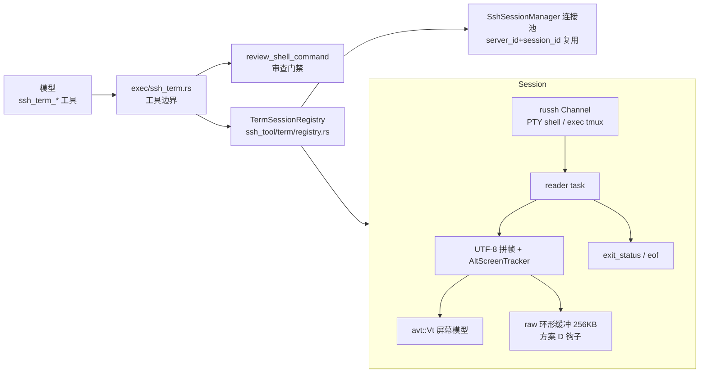

# SSH 交互终端工具组设计（ssh_term_*）

状态：设计定稿，待实施。考察基线：2026-10-08；同日修订：① 确立「tmux 优先、avt 兜底」核心原则（§1）；② 吸收外部审查结论——连接保活与 reaper 协调（§5.1）、备用屏切换游标重置（§5.4）、send 送审附终端现场（§4.2/§7）。选型结论：**avt 0.18** 作为终端屏幕模型（已于选型调研中对比 vt100 / alacritty_terminal / vte / termwiz，avt 以活跃维护、Changes API、Apache-2.0、asciinema 全线产品生产验证胜出；API 清单经源码逐条复核，russh 签名已对照锁定的 0.63.3 核对）。

## 1. 背景与目标

`ssh_exec` 走 russh exec channel，stdin 启动时一次写入即 EOF（`command_exec.rs:136-144`），不支持中途喂入；交互检测（`PROMPT_IDLE_SECS=8` / `MAX_SILENT_IDLE_SECS=60`，`command_exec.rs:14-15`、`:245-249`）命中后只能中止并返回 `interactiveBlocked`，引导文案劝模型改写非交互命令。总有一类任务无法非交互化：REPL、全屏程序（top/htop/less/vi）、分步向导、未预见的确认提示。

**目标：把一台真实的远程终端暴露给 Agent**——agent 能打开终端、发送按键、读取屏幕，自主完成「读→决策→写」的交互循环。

**核心原则：tmux 优先、avt 兜底。** `ssh_term_open` 默认探测远端 tmux：存在则以 attach-or-create（`tmux new -A -s <专属会话>`）进入 tmux 会话——交互程序由远端 tmux daemon 保活，SSH 连接断开 / 应用重启后现场仍在，同名 open 即恢复，人类亦可 `tmux attach` 共屏围观接管；不存在（或 attach 失败）则回退主路：russh PTY + avt 自建虚拟终端。两条路对模型呈现同一套 `ssh_term_*` 契约（send/read/close/list 无感知差异），tmux 语义只体现在载荷的 `tmuxSession` 字段与断连/detach 恢复提示上。tmux 是增益层而非依赖：任何服务器零远端要求即可用主路工作。

**非目标（本期不做）：**

- 前端围观/接管终端（方案 D，留钩子）；
- 人工输入弹窗（方案 C，密码类输入的正解，另立设计）；
- 本地终端工具组（架构同构，先验证 SSH 侧）。

## 2. 核心选型：avt 能力清单（源码实证）

依赖：`avt = "0.18"`（依赖仅 rgb + unicode-width，自研解析器）。以下 API 均逐条核对过 crate 源码：

| 能力 | API | 源码位置 | 我们的用途 |
| --- | --- | --- | --- |
| 构造 | `Vt::builder().size(cols, rows).scrollback_limit(n).build()` | `vt.rs:12-16, 86-105` | 每个终端会话一个 `Vt`，80×24 + 回滚 1000 行 |
| 喂入 | `feed_str(&str) -> Changes` | `vt.rs:20-28` | reader 任务把 channel 字节经 UTF-8 拼帧后喂入 |
| 变更通知 | `Changes { lines: Vec<usize>, scrollback: Box<dyn Iterator<Item=Line>> }` | `vt.rs:119-121` | `lines` = 本次喂入弄脏的行号；`scrollback` = **超出回滚上限被裁掉的行**（归档信号，非"进入回滚的行"） |
| 屏幕快照 | `view() -> Iterator<&Line>` + `Line::text()` | `terminal.rs:636`、`line.rs:324` | **活动缓冲区**的可见行（含全屏程序）；尾随空单元已 trim |
| 回滚+视口 | `lines() -> Iterator<&Line>` | `terminal.rs:640` | 增量读游标的坐标系 |
| 光标 | `cursor() -> Cursor` | `terminal.rs:339` | 辅助判定"停在提示符" |
| resize | `resize(cols, rows) -> Changes` | `vt.rs:41` | 与 russh `window_change` 同步 |
| 状态重建 | `dump() -> String` | `vt.rs:74`、`terminal.rs:1327-1443` | 输出完整 ANSI 重建序列（含主/备缓冲区）——方案 D 前端迟到补帧的钩子 |

**两个已确认的坑，设计已绕开：**

1. **`text()` 只返回主缓冲区**（`terminal.rs:648-650` 显式取 `primary_buffer()`）——快照全屏程序必须用 `view()`，禁止用 `text()`。
2. **无公开备用屏幕查询**（`Terminal::active_buffer_type()` 存在但 `Vt.terminal` 为私有字段）——自行在字节分接层实现 `AltScreenTracker`（见 §5.3）。
3. 备用缓冲区 `gc()` 恒返回空（`terminal.rs:343-354`）——全屏程序不产生回滚裁切事件，增量轨在备用屏下天然静默，符合预期。

## 3. 架构总览



复用而非新建：SSH 连接复用现有 `SshSessionManager.connection_for`（`ssh_tool/mod.rs:397`）；审查复用 `review_shell_command`（`ssh_review.rs:107`）；审计复用 `ssh_audit_log`；取消复用 `ToolInvocationContext.cancel_rx` 传播链。**不新增数据库表、不动 schema、不新增前端契约事件**（v1 工具卡片走既有工具调用 UI）。

模块布局（单文件 ≤500 行纪律）：

| 文件 | 职责 |
| --- | --- |
| `src-tauri/src/ssh_tool/term/mod.rs` | 公共类型（TermId、TermInfo、ReadPayload）+ 错误 |
| `src-tauri/src/ssh_tool/term/registry.rs` | `TermSessionRegistry`：登记/查询/关闭/空闲回收/会话级联清理 |
| `src-tauri/src/ssh_tool/term/session.rs` | `TermSession`：channel 开壳/写入/window_change/关闭、reader task 生命周期 |
| `src-tauri/src/ssh_tool/term/screen.rs` | avt 胶水：UTF-8 拼帧、`AltScreenTracker`、双轨游标（new_lines 算法） |
| `src-tauri/src/agent/rig_ext/tools/exec/ssh_term.rs` | 5 个 `PortableDynamicTool` 构造器，参数提取/审查/台账 |

## 4. 工具组契约

### 4.1 `ssh_term_open`

```json
{"server_id": "server-4", "session_id": "aikhd-debug", "command": "可选，直接以 exec 起交互命令", "tmux": "auto|off", "tmuxSession": "可选，如 jkagent-install-nginx", "cols": 80, "rows": 24}
```

- 无 `command` 时按 `tmux` 策略分路（默认 `auto`）：
  - **auto**：先在同连接上开临时 channel 探测 `command -v tmux`（应用固定字符串、只读零副作用，免审，见 §7）。命中 → PTY + `exec(true, "tmux new -A -s <tmuxSession>")`（attach-or-create：会话在则恢复现场、不在则新建）。命令串由应用按固定模板拼装，模型可控输入仅会话名且过白名单校验（`jkagent-` 前缀 + `[A-Za-z0-9_-]{1,48}`），注入面封闭，免 LLM 审查、落审计（§7）。若 exec 意外立即退出（tmux 配置损坏 / 权限等），关闭该 channel 回退裸 shell 路径，返回载荷 `note` 带上 tmux 报错尾部。
  - 探测未命中 / `tmux=off` → **主路**：`request_pty(false, "xterm-256color", cols, rows, 0, 0, &[])` → `request_shell(false)`，开登录 shell。
  - `tmuxSession` 缺省自动生成 `jkagent-<term_id 末 6 位>`；模型跨连接恢复现场时显式传回上次载荷中的同名值（attach-or-create 语义下即恢复）。
- 有 `command`：PTY 后 `exec(true, cmd)`——等价于命令执行，**走审查门禁**（`review_enabled=false` 的服务器口径同 ssh_exec 普通命令）；此路径不叠 tmux（交互命令本身即现场，进程退出会话随之结束）。
- `cols/rows` 缺省 80×24，夹紧 40..200 × 10..60。
- 返回 `{termId, screen, cursor, tmuxSession, note}`——`tmuxSession` 为实际 tmux 会话名（null = 裸终端）；tmux 模式首屏即 tmux 全屏 UI（备用屏形态，见 §5.4），screen 轨为主要信息源。工具描述中写明：长任务 / 有 tmux 的服务器优先默认路径（auto），可获断连恢复与人类共屏。
- 配额：每 server ≤4、全局 ≤16，超限返回可恢复错误并附现有会话清单，引导模型先 close。

### 4.2 `ssh_term_send`

```json
{"term_id": "term_...", "text": "sudo apt install htop\n", "intent": "安装 htop 系统监控工具"}
```

- **每次 send 都是命令执行**：`text + intent` 一并送 `review_shell_command`；`intent` 为必填（≤200 字符），给审查模型补上下文，同时落 `ssh_audit_log`——没有 intent 的裸按键片段审查模型无法判定。
- **送审载荷附终端现场**：除 `text + intent` 外，附 Vt 当前输入行（光标所在行）与屏幕尾部 5 行——审查模型据此看到真实终端状态而非裸按键碎片（`Y\r` 单看不可判，配合屏幕上的 `Do you want to continue? [Y/n]` 即可裁决），弥补按键流碎片化的审查盲区（§7）。
- 支持控制字符：`\u0003`（Ctrl-C）、`\u001b[A`（方向键）等，工具描述中逐字写明常用转义；tmux 会话下的前缀键即普通按键（detach 用 `\u0002d` = Ctrl-B d）。
- 大小上限 8192 字符（对齐 `validate_command` 口径）。
- **密码红线写进工具描述**：禁止经 send 输入任何口令/密钥；遇到密码提示应改用无交互路径或请用户介入（为方案 C 预留语义）。
- 目标已 `exited` → 返回 `command_failed` 类错误并附 exit_code。
- 返回 `{ok: true, cursor}`；echo 回显经 reader 自然进入输出轨，不额外返回。

### 4.3 `ssh_term_read`

```json
{"term_id": "term_...", "wait_ms": 5000}
```

- `wait_ms`（0..25000）：无新数据时挂起等待，任一字节到达即返回——**模型的防轮询阀**，避免 sleep 式空调用。会话内 `tokio::sync::Notify`，reader 每收一帧 notify 一次。
- 恒返回双轨载荷（模型无需做模式选择，也补偿了 avt 无备用屏查询的缺口）：

```json
{
  "termId": "term_...",
  "newLines": ["自上次 read 以来新增的行"],
  "screen": "当前可见屏幕纯文本（含全屏程序渲染结果）",
  "cursor": {"row": 12, "col": 5},
  "altScreen": false,
  "tmuxSession": null,
  "exited": false, "exitCode": null,
  "idleMs": 1530,
  "truncated": {"newLines": false}
}
```

- `newLines` 上限 200 行 / 12000 字符（命令类口径），超限置 `truncated.newLines=true`，完整内容始终可用 screen + 后续 read 补齐。
- `idleMs`（距上一帧输出的毫秒数）辅助模型判断"是否停在提示符等输入"。
- `exited=true` 时 `exitCode` 为远端退出码（缺省 -2，对齐 `command_exec.rs:26`），screen 保留最终画面；tmux 会话下 detach 以 exit 0 收口、断连为 `exitCode=null`，两种形态的 note 均附 tmux 恢复指引（§5.5）。

### 4.4 `ssh_term_close`

幂等。`channel.close()` 5s 宽限（对齐 `command_exec.rs:168-172`），移除注册表项，回收 reader task，审计落库。返回 `{termId, exited, exitCode}`。

tmux 会话下 close 语义分档（可选参数 `killTmuxSession`，默认 false）：

- **detach（默认）**：仅断开 agent 侧 attach channel，远端 tmux 会话与其中进程保留——这是持久化卖点的兑现点；返回载荷附 `note` 提示「现场保留在 tmux 会话 <tmuxSession>，同名 open 可恢复」。
- **kill（`killTmuxSession=true`）**：先经临时 channel exec `tmux kill-session -t <tmuxSession>`（模板命令 + 白名单会话名，免审落审计，§7）再关闭，彻底回收远端现场。

### 4.5 `ssh_term_list`

可选 `server_id` 过滤，返回 `[{termId, serverId, sessionId, tmuxSession, createdAt, lastActivityAt, exited}]`。供模型在长跑/重载后重新发现自己打开的终端，也供超限时报错附清单；`tmuxSession` 让模型在终端被空闲回收 / 断连后仍能凭同名 open 恢复远端现场（远端遗留的 tmux 会话可用一条 ssh_exec `tmux ls` 自助枚举）。

## 5. 数据通路实现要点

### 5.1 开壳序列（russh 0.x）

```
connection_for(server_id, session_id)            // 复用连接池，锁外建连；TermSession 持有返回的 Arc<SshConnection> 强引用
→ （tmux auto 路径）临时 channel：exec "command -v tmux" 探测，即起即收
→ handle.channel_open_session().await
→ channel.request_pty(false, "xterm-256color", cols, rows, 0, 0, &[]).await
→ channel.request_shell(false).await  /  channel.exec(true, tmux_new).await  /  channel.exec(true, command).await
→ spawn reader task → 登记 TermSession
```

写入 `channel.data(bytes)`；缩放 `channel.window_change(cols, rows, 0, 0)` + `vt.resize()` 两侧同步；EOF/关闭 `channel.eof()` / `channel.close()`。签名已对照锁定的 russh 0.63.3 核对（`data<R: AsyncRead + Unpin>`，`&[u8]` 直接可用）。

两个实施须知：PTY 下无独立 stderr（远端 stderr 复用 PTY 主流），tmux/command 的 exec 路径 reader 不必期待 `ExtendedData`；`want_reply=false` 意味着 PTY / shell 请求被拒不显式报错、只表现为 channel 随即关闭，诊断文案需覆盖这一形态。

**连接保活与 reaper 协调（审查 P1）**：连接池 reaper 按 `last_used_ms` 原子时间戳回收（`mod.rs::reap_idle_connections`），而 `touch()` 仅在 ssh_exec 命令完成时调用——挂终端的连接若 30 分钟无 ssh_exec 走完，会被下一次任意 ssh_exec 触发 reaper 移出池：TermSession 持有 `Arc<SshConnection>` 时成为池外孤儿连接（同 server 双连接并存），仅持 Handle 弱语义则直接断连误标「连接已断开」。因此：① TermSession 必须持有 `Arc<SshConnection>`；② reader 每收一帧、以及 send/read 工具调用时同步 `connection.touch()`，保证活跃终端的底层连接不被回收。

### 5.2 UTF-8 拼帧（avt 吃 `&str`，channel 给字节）

```rust
struct Utf8Framer { pending: Vec<u8> }  // pending ≤ 4 字节

fn push(&mut self, chunk: &[u8]) -> String {
    self.pending.extend_from_slice(chunk);
    let valid = match std::str::from_utf8(&self.pending) {
        Ok(_) => self.pending.len(),
        Err(e) => e.valid_up_to(),
    };
    let s = String::from_utf8_lossy(&self.pending[..valid]).into_owned();
    self.pending.drain(..valid);
    s
}
```

### 5.3 AltScreenTracker（补偿 avt 缺口）

在拼帧输出上做字节级扫描的状态机：识别 `ESC[?1049h` / `ESC[?1047h` / `ESC[?47h`（进备用屏）与对应 `l` 结尾（回主屏）。转义序列可能被 TCP 分包切断，扫描保留尾部 ≤8 字节 carryover 拼接后再匹配。约 40 行 + 专项单测（含分包切断用例）。

### 5.4 new_lines 双轨游标算法

> **实施修正（M1 落地时）**：原「行数不变量」算法有两处实测盲区，已替换为**光标行定稿算法**——
> ① 不满屏输出不触发滚动、行数不变，newLines 恒空（短命令增量语义失效）；② avt 探针实证：
> 滚动时光标停在视口最后一行不动、行进回滚区但 `scrollback` 仅在超出回滚上限被裁时产出，
> 「`ejected + cursor_row`」坐标在滚动期失效。定稿算法：feed 后若光标绝对行推进，则定稿
> `[游标, 新光标)` 区间全部行（绝对行号 = `ejected + retained - rows + cursor_row`，探针
> 校准）；同行重写（`\r` 进度条）不定稿、最终形态在推进时进入；被裁行从 `changes.scrollback`
> 文本补定稿；光标回跳（清屏）重置不补收。另注意 avt 坐标二义性：`lines()` 迭代是总坐标、
> `vt.line(n)` 是视口坐标（越界 panic）。

不依赖 `Changes.lines` 的坐标语义（脏行号在 `gc()` 之前采集、坐标随回滚伸缩漂移，实施期以单测锁定行为），采用**行数不变量**：

```
每次 feed_str 后：
  retained = vt.lines().count()                // 回滚+视口总行数
  total_abs = ejected_so_far + retained        // 历史上出现过的总行数
  新增行 = total_abs - last_emitted_abs
  新行文本 = lines()[last_emitted_abs - ejected_so_far ..].map(Line::text)
  ejected_so_far += changes.scrollback.count() // 本次被裁掉的行数
  last_emitted_abs = total_abs
```

原地重写的行（进度条 `\r` 刷新）坐标不增，自然不进 `new_lines`——它们的最终形态由 `screen` 轨呈现。这正是双轨设计要的效果：行式输出走增量、全屏/原地刷新走快照，模型各取所需。

**备用屏切换的游标重置（审查 P2）**：行数不变量隐含「`lines().count()` 单调（除被裁）」假设，但 avt 进备用屏会重建备用缓冲（scrollback 上限 0）、退屏换回主缓冲——切换瞬间 `retained` 突变（如 1024→24→1024）：切入时增量算出负值、游标切片越界，退回时切屏前的旧行被爆发式误报为新增。处理：AltScreenTracker 识别到切入事件即**暂停增量轨**（newLines 恒空，信息由 screen 轨承载），识别到退回事件时把 `last_emitted_abs` 重对齐为当前 `total_abs` 后恢复。注意 tmux client attach 本身即进备用屏——此路径在 tmux 模式下是常态而非边角（§2 坑 3「增量轨天然静默」只覆盖备屏运行期间，不含切换瞬间）。

### 5.5 退出与半死状态

reader 对 `ChannelMsg::ExitStatus` 记录退出码、`Eof/Close` 结束任务并标记会话终止；连接断开（channel error）标记 `exited=true, exitCode=null` 并在 read 载荷附 `note: "连接已断开"`——不伪装成正常退出，对齐 `ExternalStateUnknown` 不自动重跑纪律。tmux 会话下退出语义增强：detach（Ctrl-B d）以 exit 0 收口，note 附「现场仍在 tmux 会话 <tmuxSession>，ssh_term_open 传同名 tmuxSession 可恢复」；异常断连的 note 同样给出 tmux 恢复指引——远端 tmux daemon 不随 SSH 连接关闭，现场大概率存活，重开即续。

## 6. 生命周期与清理纪律（对齐会话资源清理规范）

- **归属**：`TermSession` 记录 `(workspace_id, server_id, session_id)`；注册表存于 `SshSessionManager` 旁的应用状态。
- **级联关闭**：`session_delete` / `dispatcher_clear_messages` 关闭该会话全部终端（同图片目录回收纪律）；`project_delete` 遍历级联。均挂在既有清理挂载点上。tmux 会话下级联关闭取 **kill 语义**（§4.4）：远端 tmux 会话是会话副作用资源，对齐「不能只清本地」纪律；对可达服务器额外 best-effort 执行 `tmux list-sessions` 按 `jkagent-` 前缀过滤，回收本会话失联遗留的孤儿会话（连接已断时容忍失败并在审计留痕）。
- **截断保留**：`truncate_messages_from` **不**关闭终端（同 chat images 复用思路——重发后模型可能继续用；`ssh_term_list` 保证可发现）。
- **run 取消不强制关**：终端可能跨轮使用；取消只中断在途 read 的 `wait_ms`。
- **空闲回收**：30 分钟无工具调用（open/send/read 任一）即回收，周期与连接池 reaper 同步。「活动」以工具调用计、**不以输出帧计**——tmux status-line 时钟每 15-60s 刷新输出，若按输出续命则 tmux 终端永不空闲回收。tmux 模式回收仅 detach（现场保留，凭 `tmuxSession` 同名 open 可恢复），裸终端回收即关闭远端进程。
- **应用退出**：`Drop` 全量关闭。

## 7. 安全与审查红线

| 动作 | 审查 | 审计 |
| --- | --- | --- |
| open tmux 探测（`command -v tmux`） | 免审（应用固定字符串、只读零副作用） | 并入 open 记录 |
| open（tmux auto 命中 → exec 模板命令） | 免审（见下方论证） | 落 open 记录（含 tmuxSession 与非法名拒绝） |
| open（裸 shell） | 免审（未执行命令） | 落 open 记录 |
| open（带 command） | 同 ssh_exec 普通命令 | 落命令与裁决 |
| **每次 send** | **必审**（text + intent + 当前输入行 + 屏幕尾部 5 行），未配置审查模型 fail-closed | 落 text 摘要+intent+裁决 |
| read / list | 免审（只读） | 不落 |
| close（detach） | 免审 | 落 close 记录 |
| close（killTmuxSession）/ 级联 kill | 免审（模板命令 + 白名单会话名，同 open tmux） | 落命令摘要 |

**模板命令免审的安全论证**：`tmux new -A -s` / `tmux kill-session -t` 的命令串由应用按固定模板拼装，唯一模型可控输入是会话名，经 `jkagent-` 前缀 + `[A-Za-z0-9_-]{1,48}` 白名单校验后不存在元字符注入面——与 `build_sudo_wrapped_command`「本地包装、注入面封闭」同一先例（`command_exec.rs:236-241`）。审查门禁拦的是模型生成的任意命令，模板命令不属于该面；故免 LLM 审、但全量落审计。

**send 审查的粒度补偿（审查 P3）**：ssh_exec 审完整命令串，send 审按键碎片，信息量天然偏弱；送审附当前输入行 + 屏幕尾部 5 行后，审查模型看到的是真实终端状态而非裸片段，实质缩小差距。残余弱点如实接受：`intent` 是被审 agent 的自述，审查延迟（一次 LLM 调用）在交互密集场景明显——工具描述引导模型合并按键（一次 send 发整段多行文本）减少调用次数。

- 密码/密钥禁止经 send（工具描述逐字约束 + 审查 prompt 标注）；sudo 场景仍走 `ssh_exec(sudo=true)` 的登录密码通道，不引入口令进上下文。
- send/read/close 通过 `ClaimResource::SshServer` 与同 server 的其他副作用互斥排序；open 不持有长期资源锁。

## 8. spec.rs 与挂载

`TOOL_POLICY_TABLE` 补 5 行：`category=Ssh`；open/send/close 为 `EXTERNAL_EFFECTS`、send 标 `review_self_managed`（`SELF_REVIEWED_TOOLS`（`spec.rs:271`）为硬编码名单，ssh_term_send 需入册）；read/list 只读；全部 `unified_timeout=true`（read 的 wait_ms ≤25s < 默认 60s，无需自管超时与 settle ceiling）；`parallel_readonly=false`；compress 走默认 5000 阈值。**超时口径核对**：send 为统一超时（默认 60s）且内嵌一次审查 LLM 调用，而 `review_shell_command` 自身无内部超时、在 ssh_exec 侧吃的是 600s 自管预算——同一审查链路两种口径，实施期必须给 send 内的审查调用包独立预算（如 20s，超时按 fail-closed 拒绝 send 并提示重试），避免「审查模型慢拖满统一超时、模型侧只见 send 莫名超时」。挂载：普通聊天 `plain_chat.rs::build_surface`、子智能体 `runner.rs::build` 继承；**不进**编排器数据面（`ORCHESTRATOR_RUNTIME_TOOL_NAMES` 不变）。

**ssh_exec 引导改造**：`command_exec.rs` 交互中止文案追加一句——「该命令需要交互输入，可用 ssh_term_open 打开终端会话执行后配合 ssh_term_send/ssh_term_read 完成交互」。错误回灌上下文后模型自行切换工具，自修复闭环零额外成本。

## 9. 前端契约

v1 **无新增**：五个工具走既有工具卡片 UI，结果 JSON 经既有工具结果管道（内联上限/压缩/产物）。tmux 模式下「人类围观」已有零前端成本的路径——用户自行 ssh 登录后 `tmux attach -t <tmuxSession>` 即与 agent 共屏（`tmuxSession` 在工具卡片结果 JSON 中可见）。方案 D 预留：会话内 raw 环形缓冲（256KB）+ `vt.dump()` 全量重建序列，未来实现「只读围观」时前端 xterm.js 先吃 dump 再追增量，无需后端改协议。

## 10. 测试计划

- **screen.rs 纯函数**：UTF-8 分包拼帧（多字节切断）；AltScreenTracker（含序列跨包）；new_lines 游标（录制字节流回放：`ls` 增量、进度条 `\r` 重写、htop 备用屏、无换行密码提示符四种夹具）；**备屏切换游标重置**（进屏 newLines 恒空、退屏重对齐后无假增量爆发——用 tmux attach 的录制流回放断言）。
- **tmux 层**（russh 回环 server fixture 起真 tmux，CI 无 tmux 环境则脚本桩模拟协议形态）：探测命中走 exec 模板路径；探测未命中 / attach 立即退出回退裸 shell 且 note 带报错尾部；attach-or-create 同名恢复现场；close detach 保留 / killTmuxSession 彻底回收；非法 tmuxSession（缺前缀 / 非法字符 / 超长）拒绝并落审计；空闲回收不受 status-line 时钟刷新续命；级联清理 kill + `jkagent-` 前缀孤儿回收。
- **registry**：配额上限、空闲回收（虚拟时间）、级联清理触发点。
- **session**：russh 本地回环 server fixture（russh 自带服务端能力），验证开壳/send/read/exit_code/断连标记全链路。
- **审查**：未配置审查模型时 send fail-closed；intent 缺失拒绝；送审载荷含屏幕上下文；裁决拒绝落审计。
- **spec.rs 守护**：5 工具登记完整、非自管超时无需 ceiling 声明、ssh 类别资源声明正确。
- 端到端：假模型脚本化交互（open→send→read 断言 screen 含预期提示符）。

## 11. 里程碑

| 阶段 | 范围 | 验收 |
| --- | --- | --- |
| M1 | registry/session/screen 三模块 + open/send/read/close 四工具 + **tmux 探测与 auto 叠加（attach-or-create / 回退 / killTmuxSession）** + reaper 协调与备屏切换游标重置（§5.1/§5.4）+ ssh_exec 引导文案 | 假模型完成一次真实交互（安装类命令确认提示应答）；有 tmux 服务器上 attach-or-create 生效、无 tmux 服务器回退主路；单测全绿 |
| M2 | `ssh_term_list` + read 的 `wait_ms` + `ssh_term_resize` + 断连/detach 恢复指引精化 + send 送审附终端现场 + 级联清理 tmux kill 与前缀孤儿回收 + AltScreenTracker 精化 | 长任务等待无轮询空转；全屏程序场景快照正确；断连后同名 open 恢复远端现场 |

> **M2 完成态（2026-10-08）**：全项落地。list/wait_ms 随 M1 提前交付；resize 全链（window_change + vt.resize 两侧同步，SUBSYSTEM_MANAGED 口径）；送审附屏走 `CommandReviewPayload.screen_context`（光标行就地标注 + 尾部 5 非空行，1200 字符来源侧截断，渲染层 `optional_section` 范式）；孤儿回收经审计反查（复用 `load_audit_async` 最近 100 条窗口 + `tmux new -A -s` 名提取，best-effort 接受修剪窗口）；reader 断连 note 区分 `handle.is_closed()`；AltScreenTracker 补 RIS（`ESC c`）复位。 |
| M3（另立设计） | 方案 C 人工输入弹窗（复用 `review_confirm.rs` 挂起机制，扩自由文本） | 密码提示符场景人工接管，口令不进上下文 |
| M4（另立设计） | 方案 D 只读围观（dump 补帧 + 增量字节流推 xterm.js） | 前端实时渲染 agent 终端 |
