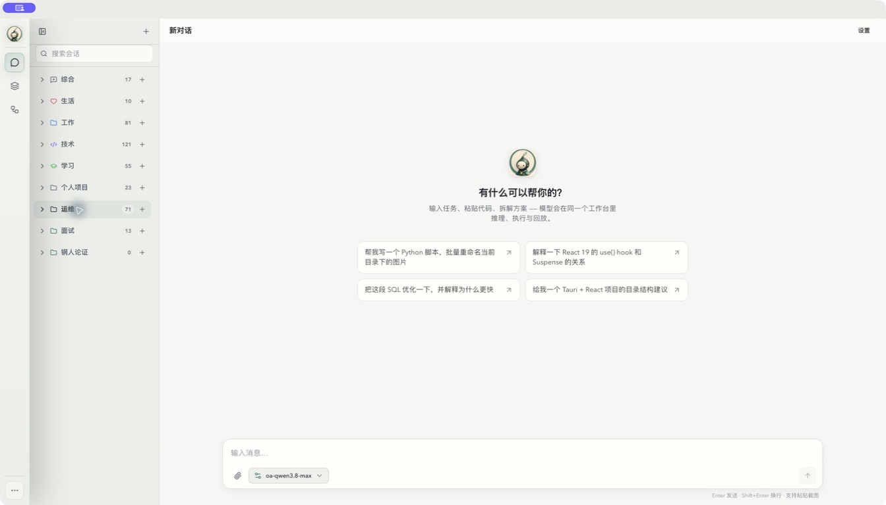
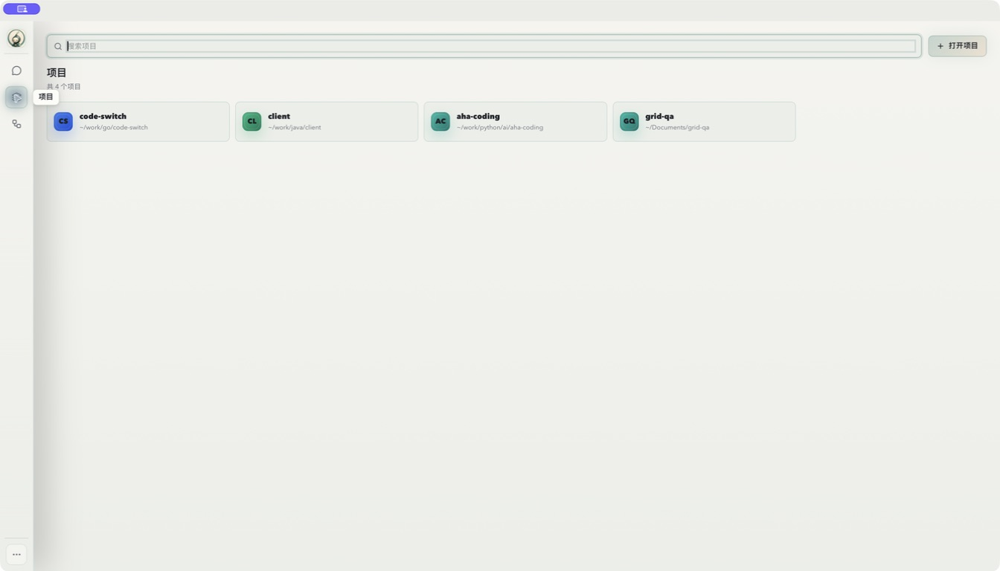
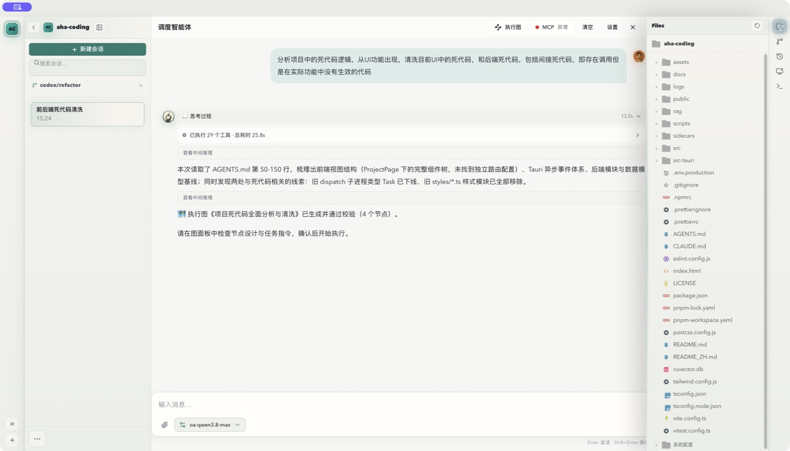
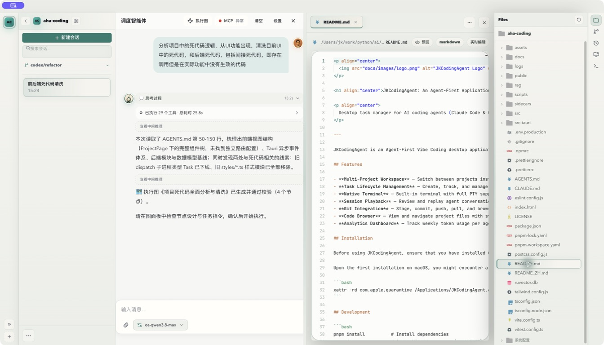
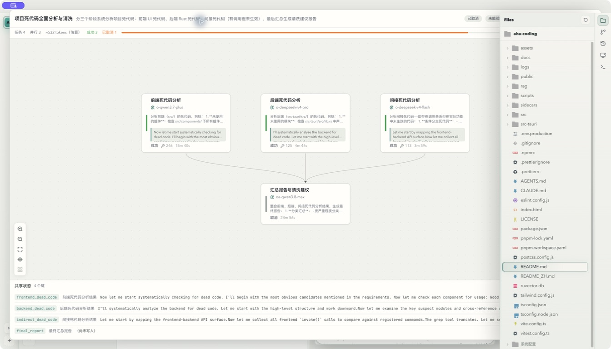
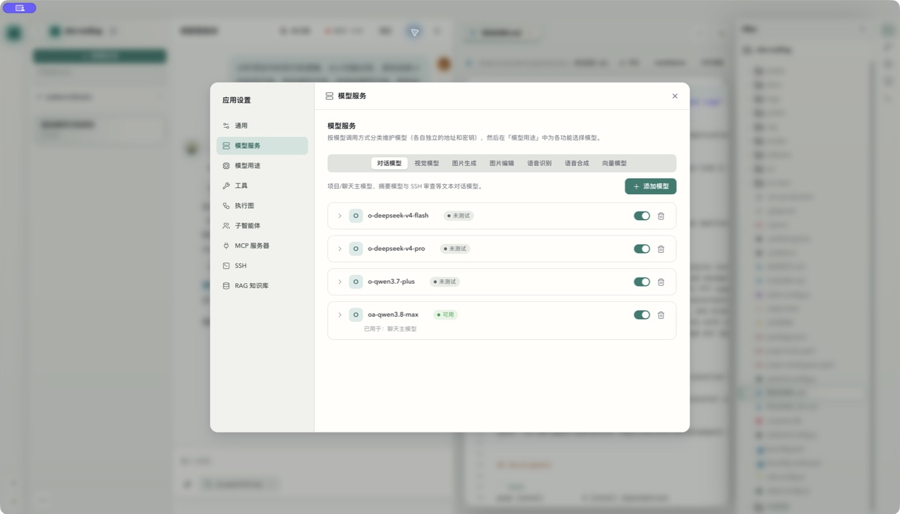
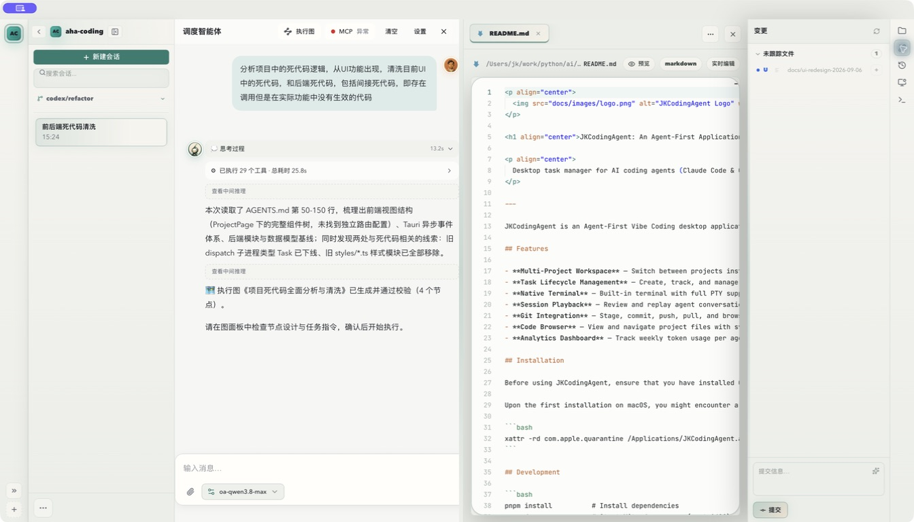
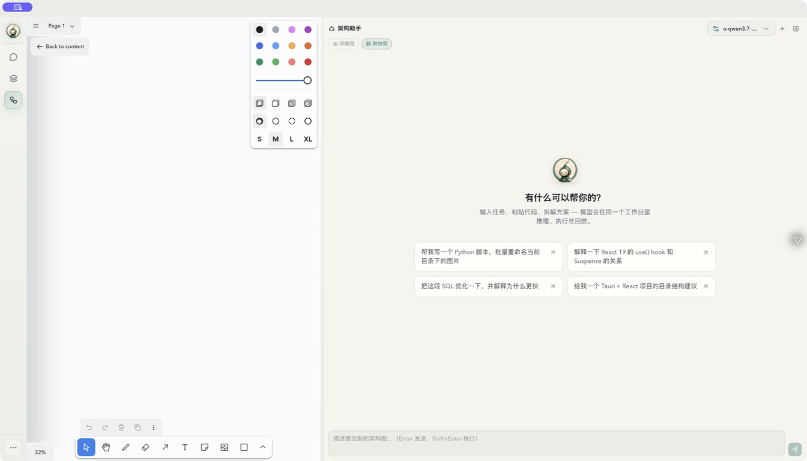

# 现有界面审查

## 1. 方法与判定边界

审查目标是开发者日常「选项目 → 发任务 → 看执行 → 看代码/变更 → 验证」的桌面工作流，同时覆盖独立聊天和架构设计入口。

证据分为三类：**V = 本次安装包截图/交互观察；C = 当前源码事实；D = 基于证据的设计判断**。V 不自动代表当前 commit 的缺陷，C 不自动代表已完成运行时验证，D 不是用户研究结论。没有开展用户访谈、可用性计时、屏幕阅读器测试或性能基准测试。

截图来源、版本和限制见 [总览](README.md)。检查时只查看已有任务与文件，未点击运行、重跑、提交、暂存或删除。打开项目会按现有应用行为更新最近打开时间；没有改动项目文件内容。

## 2. 当前功能与布局地图

| 区域 | 当前真实实现 | 视觉/交互特点 | 依据 |
|---|---|---|---|
| 应用外壳 | `App` 在 Welcome 与多个已挂载 ProjectPage 之间切换 | 项目用隐藏保活；顶部有窗口拖拽安全区 | `src/App.tsx`、`ProjectWorkspaceLayout.tsx` |
| 主页 | 聊天、项目、架构设计三入口 | 60px 全局图标栏；默认聊天；项目卡片网格 | `WelcomePage.tsx`、V01/V02 |
| 独立聊天 | 分类/会话、关键词、消息、模型选择、图片、工具/子智能体详情 | 自有可折叠侧栏，正文居中，底部输入，可打开详情 dock | `HomeChatPage.tsx`、`chat/chat-shell.tsx`、V01 |
| 项目工作台 | 项目 rail、会话、聊天、代码/diff、右侧文件/Git/浏览器、底部 Shell | 56px 项目 rail + 288px 会话栏 + 中央分屏 + 右面板 + 48px 工具栏 | `ProjectPage.tsx`、V03/V04/V07 |
| 文件/编辑器 | 文件树、多标签、Monaco、Markdown/图片/大文件查看 | 导航在右、编辑器居中；编辑器还有路径/预览工具行 | `FileViewer.tsx`、`file-viewer/`、V04 |
| Git | 变更列表、暂存/提交、历史、文件/提交 diff | 列表在右侧，diff 在中央替换编辑内容 | `GitChanges.tsx`、`GitHistory.tsx`、V07 |
| 执行图 | 计划卡片、React Flow 画布、节点抽屉、共享状态、继续/重跑 | 全屏式覆盖层，双层头部、底部共享状态 | `graph/`、V05 |
| 架构设计 | tldraw 画布与架构助手，可附截图/快照 | 与运行 DAG 独立，助手宽度可调/可折叠 | `architecture/ArchitectureView.tsx`、V08 |
| 浏览器 | 会话绑定的浏览器帧、地址栏、日志、展开、最小化 dock | 与文件/Git 复用项目右面板；主页另有浏览器容器 | `BrowserPanel.tsx`、`BrowserDock.tsx`、`useBrowserSessionDock.ts` |
| 终端/Python | xterm Shell、Python 运行抽屉 | Shell 默认高 240px；Python 跟随代码块执行记录 | `ShellTerminalPanel.tsx`、`ChatPageOverlays.tsx` |
| 设置 | 通用、模型服务/用途、工具、执行图、子智能体、MCP、SSH、RAG | 左侧导航 + 内容页 + 分类 tabs；自动保存 | `AppSettingsDialog.tsx`、`settings/`、V06 |
| 用量 | 存在会话 token 用量 hook 和后端命令 | 本次未找到 AGENTS 所述 AnalyticsDashboard 当前入口/组件 | `useDispatcherSessionTokenUsage.ts`、`src-tauri/src/app/mod.rs` |

说明：以上组件名默认相对 `src/components/`。`types.ts` 当前还导出 `src/types/` 领域类型。AGENTS/README 中“分析面板”“旧主视图”等叙述不能替代当前入口核对；本轮不把恢复历史分析页作为视觉改造的前提。

## 3. 八步实测记录

### V01：独立聊天首页——结构清楚，起步引导仍偏通用

全局导航、分类会话和输入框位置稳定；分类保留了折叠、数量与新增入口。空态却占据大块中心区域，建议问题与当前用户意图没有关联。左栏阴影跨入内容，选中、hover 与区域底色的差异偏轻。图标主导航主要依赖悬停标签。

改造：保留分类和输入；空态按普通聊天/项目/架构分别提供短引导。全局导航加可发现的文本提示与命令搜索；导航常驻面取消投影。

### V02：项目入口——可用，但“恢复工作”的信息不足

搜索与打开项目可见，卡片有名称和路径。当前四张卡片只占顶端一行；其余空间未帮助恢复最近会话、识别活动项目或定位上次工作。留白本身不是问题，缺少任务上下文才是问题。

改造：默认紧凑的最近项目列表，次行显示路径、最近打开时间；在数据确实存在时展示运行状态。保留打开文件夹，不加入营销式欢迎大图或无依据的统计数字。

### V03：项目聊天 + 文件栏——出现正文裁切风险

Agent 回复默认收起思考和工具活动，这一点适合长任务阅读。但本次截图中正文右缘被文件栏截断，输入框延伸至边界；文件栏明显投影覆盖聊天，系统操作“执行图/MCP/清空/设置”在头部占据显著位置。

改造：聊天列依据所在容器宽度收缩；正文与输入共享边距。标题改为当前会话任务；健康 MCP 状态放低优先级位置，异常仍保留明确入口；清空归入更多菜单。

### V04：聊天 + 编辑器 + 文件树——工作能力完整，空间竞争明显

文件树可打开真实文件，编辑标签和路径清楚；这一状态聊天有换行，不能把 V03 的现象泛化成所有分栏都溢出。左右导航加中央双栏形成五个横向区域，聊天和代码都变窄；代码周围的大圆角、边框和阴影进一步强化了“卡片套卡片”。

改造：文件树与会话列表共享导航容器、按需切换；中央最多两个主内容区。代码面板平面化，合并路径/状态工具行。窄窗口提供内容切换而非继续挤压。

### V05：执行图——图关系易懂，覆盖层存在遮挡

并行节点、汇总节点与依赖关系可以理解；运行结果与验收结论已分别展示，值得保留。右侧文件栏却盖在执行图上方，头部右侧操作不可完整看见。本次用 Escape 返回。底部共享状态默认展开，内部字段与大段输出侵占画布。

改造：先修复覆盖层挂载与层叠上下文，再把执行图作为可返回的主工作视图。节点优先呈现任务、状态、耗时与结果摘要；共享状态为按需检查器。**不能把“节点返回成功”包装成“整体任务验收通过”。**

### V06：设置中心——已有统一基础，适合小幅精修

左导航、内容分区、模型类别 tabs、折叠模型行与测试状态已经较规整。页头和正文重复“模型服务”；七分类标签在有限宽度内偏密。删除动作与启用开关同列常驻，视觉权重可以再降低。

改造：保留模型库/用途绑定和自动保存，精简重复标题；增加持续可见的保存中/已保存/失败重试反馈。保存失败不得被“关闭成功”视觉掩盖。截图没有验证焦点陷阱与键盘返回。

### V07：Git 变更——动作具备，审查与提交上下文分离

暂存和提交入口清楚，但右下提交区域与中央代码分离，中央当前仍是普通 README。截图中的未跟踪目录为本次新建的文档证据目录。本轮没有点开 diff、暂存或提交，因此不评价 diff 的真实大文件表现。

改造：进入“审查变更”时用变更导航 + 中央 diff；提交区明确暂存范围、文件数量与提交结果。保持用户显式提交，不能把 Agent 完成等同自动暂存/提交。

### V08：架构设计——画布能力独立，助手语境不匹配

可以使用画布与助手，截图/快照开关可见。当前恢复的宽度状态使助手比画布更宽；这只能说明该状态，不能说默认比例就是如此。助手空态仍建议批量重命名图片、解释 React 等；画布工具部分显示英文，与主界面语言不统一。画布处于已恢复的 32% 视口状态，不能据此判断数据为空或丢失。

改造：默认画布优先，助手约 320–400px；清晰显示附带上下文，提供“绘制分层架构”“解释选中区域”等起步提示。语言、画布定位和许可阻断状态另行验证。

## 4. 问题登记与源码关联

严重度：P0 阻碍核心内容/操作；P1 影响理解、效率或一致性；P2 视觉精修。优先级是本次设计判断。

| ID | 优先级/证据 | 发现与影响 | 源码定位/后续工作 |
|---|---|---|---|
| A01 | P0 · V03/C | 聊天在文件栏展开状态下裁切；容器宽度契约不稳定 | `tailwind.css:7094` 起的 viewport 分档；`layout/app-layout.tsx`；UI-02 |
| A02 | P0 · V05/C | 文件栏覆盖执行图，右上操作被挡 | `ChatPageOverlays.tsx` 内联 GraphPanel；`GraphPanel.tsx:240`；`ProjectWorkspaceLayout.tsx`；UI-03 |
| A03 | P1 · V04/C | 两侧导航与中央分屏竞争；侧栏固定宽，分屏只约束比例 | `tailwind.css:6370`；`useProjectPanels.ts`；`ProjectWorkbenchContent.tsx`；UI-04/08 |
| A04 | P1 · C | Artifact 实际是 420px flex sibling；注释所称“不挤压聊天的 overlay”与代码不符 | `layout/app-layout.tsx`；还未实测打开该详情状态；UI-02/09 |
| A05 | P1 · V01–04/C | 大阴影、渐变与着色边框累积；编辑器有 24px 圆角 | `tailwind.css:632`、`:1314` 附近；`App.css` 的 `.monaco-pane`；UI-05/06/16 |
| A06 | P1 · V01/03/08/C | 相同通用空态用于不同工作语境 | `chat/empty-chat-state.tsx`、`message-list.tsx`、架构助手；UI-10/15/25 |
| A07 | P1 · V03/04/C | 项目头部是“调度智能体”，任务身份弱，清空等次要动作显眼 | `ChatPageHeaders.tsx`；UI-07/11 |
| A08 | P1 · V05/C | 节点指令、输出、指标和共享字段争夺注意力 | `GraphPanelHeader.tsx`、`GraphStateInspector.tsx`、`GraphNodeDrawer.tsx`；UI-13/14 |
| A09 | P1 · C | 项目会话行是 click div，未见键盘角色/键处理；分隔条多为鼠标交互 | `SessionPanel.tsx:38` 起；`ProjectWorkspaceLayout.tsx`；UI-23 |
| A10 | P1 · C | 设置用 portal，但外壳未使用 Radix Dialog；焦点隔离需要补验 | `AppSettingsDialog.tsx`；不能仅凭此断言所有辅助功能失效；UI-21/23 |
| A11 | P1 · C | 消息已有 >300 条窗口化，但固定按 180px 估高；展开代码/工具后有定位风险 | `chat/message-list.tsx`；不是“没有虚拟化”；UI-24 |
| A12 | P2 · V02/06/08/C | 项目入口恢复信息少、设置重复标题、Files/CloakBrowser/中文及品牌称谓混用 | `WelcomePage.tsx`、`RightToolbar.tsx`、文件头部、设置、空态；UI-10/21/26 |

## 5. 设计系统现状

`App.css` 有浅/深色令牌、系统主题接入、6/8/12/16px 圆角、120/180/280ms 动效时长，UI 字体为 Avenir Next 与中文回退，代码为 JetBrains Mono 等等宽字体。`tailwind.config.js` 做颜色 alias，`cn()` 和 Radix 组件已有基础。

问题是设计语言叠加而非缺乏基础设施：`--bg-*`、`--chat-*`、`--sf-*` 多族语义并存；部分导航仍有硬编码 rgba、`!important` 和大范围投影。当前 `App.css` 1948 行、`tailwind.css` 10513 行，应分阶段消除重复定义和失配令牌，不能通过再追加一套高优先级样式掩盖旧规则。

不建议本轮重做 Logo、换 UI 框架、引入竞争性 CSS 方案或以全面动效体现“AI 感”。现有 Logo 保留为小尺寸身份标记，正文中的头像减少装饰和光晕。

## 6. 未验证项与补验清单

| 未验证项 | 原因/范围 | 补验任务 |
|---|---|---|
| 当前 commit 的完整 Tauri 构建 | 使用安装包，debug bundle 访问超时 | UI-01 |
| 深色/系统主题、1000×680 至宽屏、缩放 | 本轮仅实测当前浅色窗口；未改系统偏好 | UI-01/29 |
| Artifact、子智能体详情、Python 抽屉 | 已读关联源码，未打开对应运行状态 | UI-09/14/20 |
| 浏览器启动/最小化/恢复、Shell | 已读容器与生命周期代码，未启动附加运行器 | UI-18/19 |
| Git diff/历史完整交互 | 本轮仅查看变更面板，没有执行 SCM 动作 | UI-17 |
| 保存失败、MCP/SSH/RAG 配置错误、模型测试 | 未改配置、未调用服务 | UI-21/22 |
| 键盘遍历、读屏、实测对比度、输入法 | 截图不足以确认无障碍合规 | UI-23/29 |
| 长会话、大型 DAG、PTY 高频输出 | 无性能采样与负载测试 | UI-24/30 |

截图中的 MCP“异常”是当前状态提示，不作为视觉审查中的后端缺陷结论。本轮没有证明其原因。
