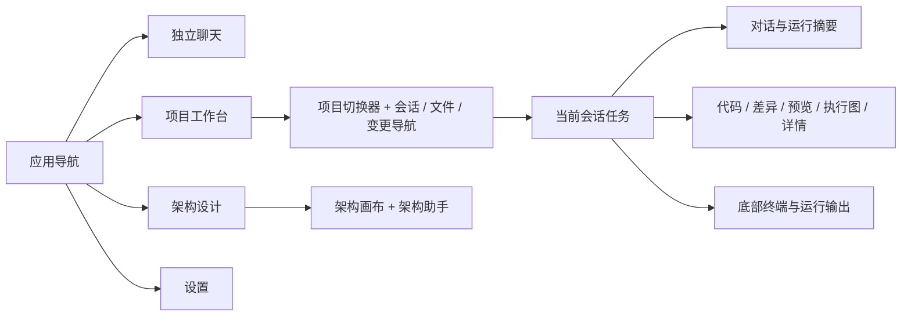

# 改造设计方案

## 1. 设计方向：安静的专业工作台

让用户第一眼知道“在哪个项目、处理哪个任务、Agent 到哪一步、下一步可以做什么”。视觉上采用低饱和中性底色、石墨正文和少量青绿强调；常驻界面平面化，编辑器和聊天拥有最大内容空间，浮层才使用明显阴影。

本方案是设计规格，不是已实现或用户选定的高保真稿。后续 UI-05 会产出浅/深色关键帧并走视觉验收。本轮不增加运行时功能，不将图示当作真实截图。

| 路线 | 优点 | 局限 | 取舍 |
|---|---|---|---|
| 只换色、圆角和阴影 | 成本小，立刻更干净 | 不解决溢出、多栏和任务状态 | 用于前期快修，不能作为终点 |
| 以代码编辑器为中心的传统 IDE | 文件/代码习惯成熟 | Agent 任务与执行成果容易退回侧边聊天 | 保留编辑能力，不作为默认布局 |
| 任务驱动的双区工作台 | 对话、执行、代码审查形成连续路径 | 需要重整导航/面板状态 | **推荐**；复用现有功能，分阶段迁移 |

## 2. 信息架构与功能归属

统一一个应用 rail 和一个可切换导航面板。rail 负责“工作空间”，导航面板负责“当前空间的对象列表”，主区负责“正在处理的内容”。项目切换器放在导航面板顶部，保留已打开项目的快捷切换与关闭语义。

这是信息归属图，不是新的执行 DAG。跨项目跳转不能改变运行任务的 workspaceId。

| 当前功能 | 目标位置 | 必须保留的行为 |
|---|---|---|
| 主页项目网格 | 项目导航的最近项目入口 | 打开本地目录、最近打开信息、项目删除确认 |
| ProjectRail | 全局 rail + 项目切换器中的已打开项目 | 关闭工作区与删除注册项目严格区分 |
| SessionPanel / 聊天 Sidebar | 统一外观的导航列表，按作用域接不同数据 | 分类、搜索、分页、会话选择、运行指示 |
| 右侧文件树 | 导航面板的“文件”页签 | 树操作、标签、重命名/删除与打开文件同步 |
| Git 变更/历史 | 导航“变更” + 主区 diff；历史作为次级页签 | 暂存/取消暂存、提交、历史查看，结果明确 |
| Artifact / 子智能体 / Python | 主区详情标签或窄屏抽屉 | 来源、执行轨迹、错误、复制/打开产物 |
| 执行图 | 主区“执行图”标签，可扩大占满主区 | 计划/运行/验收状态、节点详情、取消/恢复 |
| 浏览器 | 主区预览标签 | session 绑定、地址、加载/失败、最小化/恢复 |
| Shell | 主区下方 dock | 进程生命周期、复制、PTY resize、输出跟随 |
| 设置 | 全局唯一入口 + 上下文深链 | 直接跳模型/MCP 页、统一保存管线 |
| 架构助手 | 架构空间右侧助手 | 截图/快照开关、画布状态与撤销历史 |

“统一”首先指布局和交互契约，不是把普通会话、项目会话、架构聊天硬塞进一个 store 或一张数据库表。

## 3. 桌面空间规格

### 3.1 稳定的五个区域

| 区域 | 建议尺寸（CSS px） | 规则 |
|---|---|---|
| 窗口顶栏 | 40 高，兼容现有 38px 安全区 | macOS 交通灯安全区由平台核验；非 macOS 使用原生窗口控制布局 |
| 全局 rail | 52 宽 | 三个工作空间入口，设置置底；不再常驻一列右侧工具 rail |
| 上下文导航 | 默认 248，范围 216–320 | 会话/文件/变更互斥；可收起；拖动结束才持久化 |
| 主工作区 | 使用余下全部空间 | 最多两个并列内容面板；每个面板独立滚动 |
| 底部 dock / 状态 | dock 默认 220 高；状态 24 高 | 未打开时仅显示简洁状态；主区剩余可用高不得低于 320 |

初期不用合并窗口原生标题栏和所有工具，先固定安全区与头部对齐。进入紧凑模式时减少非核心元信息，不能缩小正文来“装下所有面板”。

### 3.2 三种工作布局

**专注对话：** rail + 会话导航 + 主聊天。正文最大宽 760px；工具/代码可在同列内展开至 960px，但受父容器宽度限制。输入框和正文左右对齐，边距 24px，窄区 16px。空白用于阅读舒适性，不用四张巨大建议卡填满。

**协作编码：** rail + 上下文导航 + 对话 + 代码/预览。对话最低 460px，代码最低 520px，中间视觉分隔线 1px、交互命中宽 4–8px。不满足两面板最低宽度时先收导航，再改为单主区标签切换。不要简单限定比例 28%–72% 后让内容继续变窄。

**审查/执行：** 主内容区以 diff 或执行图为主，聊天可收起并可一键返回。打开节点详情时替换同一个详情槽或使用有焦点管理的抽屉；不再向现有双栏追加第三块固定宽度内容。切换布局不触发任务重跑。

| 窗口参考宽度 | 默认策略 | 示例空间预算（忽略 1px 边框） |
|---|---|---|
| 1000 | 导航收起，单主区；文件/会话按需抽屉 | 52 + 948；代码与聊天切换 |
| 1280 | 导航按需；用户打开代码后可收导航进入双区 | 52 + 1228；双区需按容器实际宽度计算 |
| 1440 | 导航 + 双区 | 52 + 248 + 480 + 4 + 656 |
| 1600 | 完整双区 | 52 + 248 + 560 + 4 + 736 |
| 1920 | 完整双区，正文不无限拉长 | 52 + 248 + 680 + 4 + 936 |

上述是提案样例，不是现有测量结果。最终规则由容器可用宽高计算；浏览器嵌入与 dock 高度同样纳入预算。窗口变小触发的是临时适配，不覆盖用户保存的宽屏布局偏好，变大可恢复。

### 3.3 面板生命周期与焦点

- 每个工作区只拥有一套导航、主区活动标签和底部 dock 状态。弹出详情保存触发来源，关闭后返回原焦点。
- 普通界面、popover、drawer、modal、toast 采用明确层级；跨工作区浮层在根 portal 容器挂载。不要靠 `z-index:999999` 对抗祖先层叠上下文。
- 当前 GraphPanel 在过渡阶段先修复 portal/遮挡；迁入主工作区后作为普通视图，不再假扮全屏 modal。真正的确认框仍用 Radix Dialog。
- 会话切换清理过期详情请求并保留已有 requestId 防竞态；项目隐藏保活时不抢键盘焦点，不注册多份有效全局快捷键。
- 隐藏终端/预览不应被误实现为结束进程或关闭浏览器；关闭按钮文案区分“隐藏面板”和“结束会话”。不得通过重挂载 tldraw 解决布局问题。

## 4. 视觉设计规范

### 4.1 色彩与材质

延续现有青绿强调色，减少大面积偏绿背景。浅色像洁净纸面，深色像低反光石墨；让分区靠轻微明度差和留白建立，而不是全屏卡片投影。建议试样如下，需在 UI-05/UI-29 实测后定稿。

| 语义 / 现有令牌 | 浅色试样 | 深色试样 | 使用范围 |
|---|---|---|---|
| 画布 `--background` | `#F7F8F7` | `#151817` | 聊天、工作区底 |
| 导航 `--bg-sidebar` | `#EFF1EF` | `#111413` | 全局/上下文导航 |
| 内容面 `--bg-panel` | `#FFFFFF` | `#191D1B` | 编辑区/详情 |
| 浮层 `--bg-elevated` | `#FFFFFF` | `#222824` | 菜单/对话框 |
| 正文 `--text-primary` | `#202722` | `#E6EBE8` | 正文/任务标题 |
| 次文 `--text-secondary` | `#536159` | `#ACB8B0` | 说明/路径 |
| 分隔 `--border-dim` | `#DCE2DD` | `#323C35` | 面板边界 |
| 强调 `--accent` | 保留 `#297C70` | 保留 `#55C7AD` | 发送/选中/进度 |

这不是增加一套主题命名空间。优先调整现有令牌，并同步维护 RGB 伴随值和 Tailwind alias。`--sf-*`、`--chat-*` 中等价表面先 alias 到权威令牌，再逐组件清除重复定义；涉及代码高亮等真实语义则保留专用令牌。

常驻栏无外阴影；popover 保留轻阴影，modal 用中等阴影。输入框使用单层浅阴影；工具行、Markdown 代码块与编辑器不发光。运行使用青绿，警告/待处理使用琥珀，失败使用红，完成使用绿色；同时提供图标和文字，不能只靠彩点。

### 4.2 字体、密度、圆角

| 元素 | 规格 | 意图 |
|---|---|---|
| UI 主字体 | 系统 UI 字体 + PingFang SC / Noto Sans SC；先验证现有字体再调整优先级 | 提高系统一致性，避免额外字体下载 |
| 主界面文字 | 13px / 20px，常规 400，重要项 500–600 | 稳定紧凑；去掉 750/850 等过强标题权重 |
| 聊天正文 | 15px / 24px | 中文连续阅读 |
| 代码/终端 | JetBrains Mono，13px / 20px | 保留现有等宽字体与字体回退 |
| 辅助信息 | 12px / 18px | 文件路径、时间、用量；核心操作不低于 12px |
| 页面标题 | 18px / 26px；工作区标题 14px / 20px | 设置页和工作区不同级别 |
| 间距 | 4/8/12/16/24/32 | 内容使用间距分组，减少重复边框 |
| 行高 | 文件树 28px，会话行 40–48px，工具行 32px | 高密度但保留明确命中区 |
| 圆角 | 按钮 6px、行/菜单 8px、卡片/输入 12px、modal 16px | 工作区与编辑面 0–4px；移除编辑器 24px 圆角 |
| 图标 | lucide 16px 常规、18px 导航，统一描边 | 图标按钮默认 32×32px，紧凑操作不低于 24×24px |

正文对比度、焦点与命中区按 [WCAG 2.2](https://www.w3.org/TR/WCAG22/) 相关条款验收：普通文字至少 4.5:1，符合定义的大文字至少 3:1；目标尺寸条款为 24×24 CSS px 或满足其例外。项目采用默认 32px 按钮是设计选择，不把所有按钮强制 44px 说成桌面规范。

### 4.3 动效

保留已有 120/180ms 节奏：hover 120ms，抽屉/折叠 180ms；拖动实时跟手无弹簧。消息流不逐 token 播放入场动画；自动跟随仅在用户接近底部时发生。尊重 reduced-motion，长任务状态不连续大面积脉冲。切换图画布不能用模糊滤镜牺牲文字锐度。

## 5. 关键页面设计

### 5.1 任务导航与项目入口

导航顶部显示项目名/作用域与切换箭头；下面是“会话 / 文件 / 变更”三级同级页签，任一时刻只有一个列表。会话行先显示标题，次行显示最近时间；运行/待处理/失败用文字和小标记，不给整行染色。

项目首页优先“继续最近项目”和打开目录。可以使用已有 `lastOpenedAt`，不要求首屏扫描全部仓库分支或 Git 状态。普通聊天保留分类；项目会话保持项目作用域。搜索、更多菜单和新建入口位置一致。

### 5.2 聊天与输入

头部显示任务名称，次行/tooltip 显示项目与分支；只保留当前任务最重要的动作。输入框仍承担“描述任务 → 发送/停止”，模型选择保留在输入附近；项目名作为上下文标记，图片保持当前保存流程。

上下文文件 chip、选择代码发送等能力如果没有完整数据链路，作为后续功能单独实现，不能在视觉稿中画成已经支持。不要新增一个与后端无关的“自动/计划/执行模式”开关。

消息结构分为用户请求、Agent 进度、最终结果。连续工具活动收成一行摘要，例如“读取 8 个文件 · 修改 2 个文件 · 测试失败 1 项”；摘要只能由结构化事实生成，不能猜工具结果。点击后展示时序、耗时、输入/输出和错误。失败/待用户处理必须直接露出，不能埋在折叠成功列表里。

结果区优先回答“改了什么、怎么验证、仍有什么限制”，有可追溯文件产物时提供打开/审查入口。保留历史消息编辑、重新生成与资源回收语义，视觉改造不改动真实 token 用量。

### 5.3 执行图与子智能体

任务头部显示：总状态、已完成节点/总数、当前动作。概览行将**运行结果**与**验收结果**分开。估算 token 明确标注估算，不能与真实用量混用。

节点卡片只放任务名、角色/模型（次级）、状态、耗时、最多两行结果摘要；完整 prompt 和 JSON 放详情。执行路径高亮当前节点与相关依赖，其他边保持低对比但可辨认；大图提供定位失败/运行节点和适应画布。

子智能体详情统一为“概览 / 活动 / 输出”，共享状态放检查器。保留停止、从断点继续、完整重跑的语义区别及既有门禁；不要将状态显示迁移扩大为运行时重写。

### 5.4 编辑器、Git 与产物

编辑器使用平面标签条，活动标签靠下划线/底色识别；路径长时折叠中间段，可复制完整路径。去掉 Markdown 预览里与用户任务无关的“基于 react-markdown 渲染”等实现说明。

审查模式左侧显示已暂存/未暂存，中央显示对应 diff，头部显示路径、增删与范围；窄区域允许 unified diff，足够宽再提供并排。提交区明确“提交暂存的 N 个文件”，失败保留提交文本并提供真实错误。空变更时显示“没有待提交变更”，不制造成功指标。

产物详情展示来源会话/工具、类型、文件名和打开方式。图像、Markdown、Python 输出沿用现有渲染器；大内容使用现有分页/大文件通道，不为预览全量加载。

### 5.5 浏览器、终端与 Python

浏览器在主区占据可用宽度，保留地址栏、加载状态与回到对应会话。最小化项显示目标页面和所属会话；关闭与最小化区分。会话切换时不能显示另一个会话的活动帧。

底部 dock 的首个稳定入口是终端；Python 输出可从代码块打开统一详情。运行输出的“运行中/结束码/失败”使用同一状态视觉；隐藏输出不取消运行，取消必须调用已有停止流程。终端高频输出继续走缓冲，布局更新不能重建 PTY。

### 5.6 设置与架构设计

设置保留侧栏结构，将通用、模型、能力连接三组通过小标题分组，不额外增加层级菜单。内容页只保留一组标题/描述；分类 tabs 在窄宽度可横向滚动并保留选中可见。自动保存状态固定放在内容头部；错误信息靠近字段并可重试，API key 始终默认掩码。全局/项目 MCP 的作用域应明确可见。

架构空间让画布占主要面积，助手默认 320–400px。空态改为绘图任务示例；附截图/附快照展示本次将附带的信息。现有 tldraw 视口和撤销栈保留。暂不把架构草图转换成执行 DAG，也不添加项目级架构持久化迁移。

## 6. 键盘、可访问性与桌面行为

保留已实现的 Mod+K 命令面板、Mod+N 新会话、Mod+B 导航与 Mod+L 输入焦点；在统一外壳中处理作用域和冲突。Monaco、终端、浏览器输入有焦点时，不抢夺其编辑快捷键。Escape 只关闭最顶层可关闭界面。

会话行使用按钮或正确的复合列表语义，避免 clickable div；分隔条补键盘调整、ARIA 数值与双击复位。浮层关闭恢复触发点；危险操作不用只在 hover 才可访问的极小命中区。测试中文 IME 确认不会误发送。

macOS 使用原生窗口行为并保持拖拽空白；Windows/Linux 验证窗口控制、Ctrl 快捷键、系统字体回退。侧栏应服务层级导航，复杂对象可用列表+详情组织，参考 [Apple Sidebars](https://developer.apple.com/design/human-interface-guidelines/sidebars)。该原则不意味着需要在 Tauri 中仿制 Liquid Glass。

## 7. 实施边界与迁移方式

1. 先在当前构建复现 A01/A02，分别小改修复；这些不依赖完整视觉定稿。
2. 在现有 `App.css`、`tailwind.css @layer components`、`components/ui` 和 `cn()` 体系内完成令牌/基础控件；不新增业务 CSS 文件、不引入第二套状态库。
3. 抽取无业务副作用的布局决策函数及薄外壳；Zustand 管工作区 UI 偏好，React Query 和现有事件管业务。不要让布局组件发起任务、写 DB 或加载大文件。
4. 普通聊天与项目工作区按入口迁移，复用消息和运行器 adapter；完成调用切换后再移除旧容器。不得通过改 key/unmount 丢失流式会话、浏览器或终端。
5. 业务状态命名展示可以映射，但不得虚构后端没有的待审批/完成状态；如需新增持久化字段，另立任务同步 TS、Rust、基线 DDL 和前向迁移。
6. 每批验证后提交独立 PR，保留可按 PR 回退的边界；不要长期保留两套视觉方案和永久开关。

后续暂缓：任意拖拽 docking 框架、多窗口同步、插件商城、全新用量仪表盘、架构到 DAG 自动转换、协同编辑、品牌重命名。它们并非解决本轮视觉问题的必要条件。

## 8. 成功标准

在 1000×680、1280×800、1440×900、1600×1000、1920×1080 的目标窗口中，正文、输入框、发送/停止和返回入口完整可见；深浅主题均能区分正文、选中项、错误和焦点。完整工作流可从会话进入执行、文件/产物和 Git 审查再返回，保持原上下文。

首轮可用性验证让 3–5 名目标开发者完成同一组任务，记录路径错误、反复切栏、找不到动作和裁切问题；不预先声称效率提升百分比。量化检查与任务状态统一维护在 [跟踪清单](03-tasks.md)。
